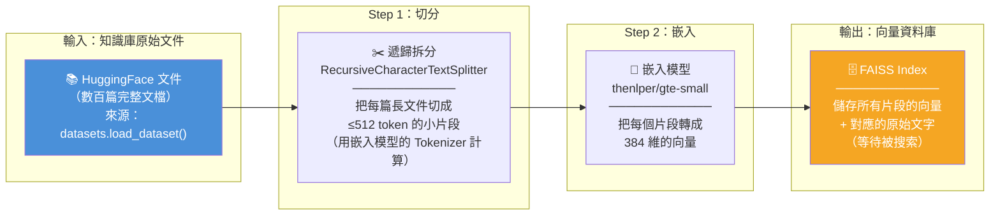
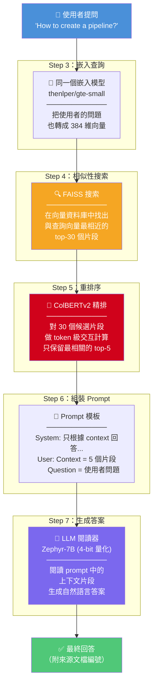
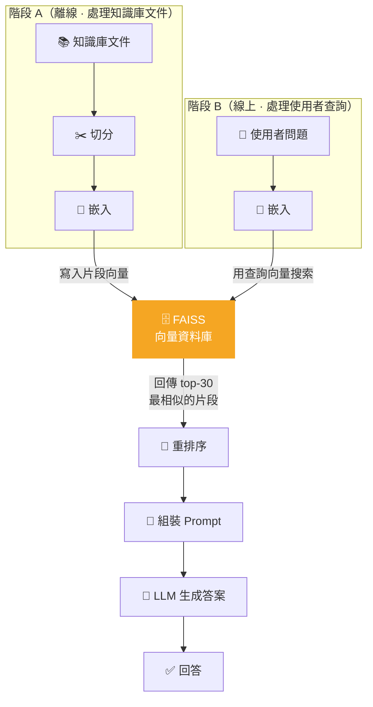
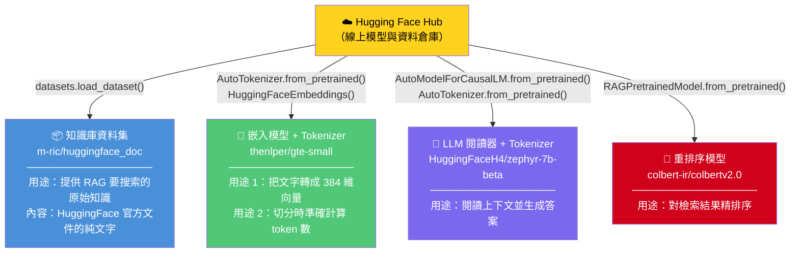
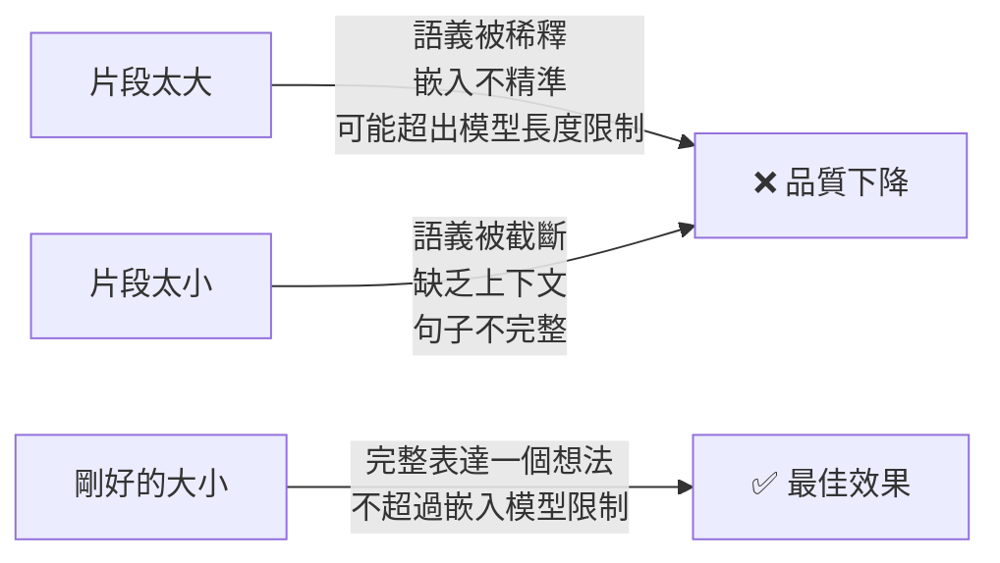
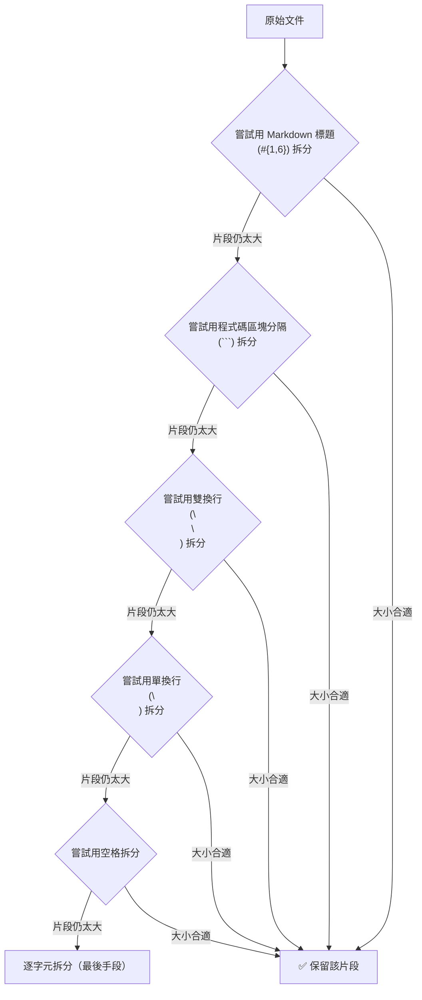
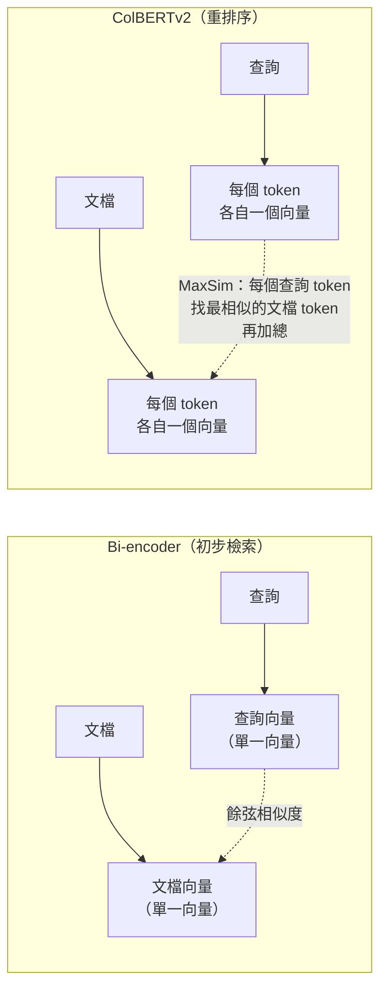
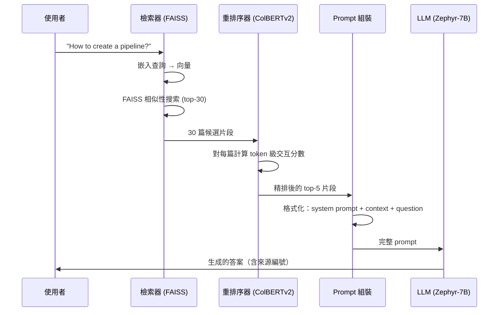

# 使用 LangChain 構建高級 RAG 系統 - 深度解析與實作指南

> 原文連結：<https://huggingface.co/learn/cookbook/zh-CN/advanced_rag>
>
> 作者：[Aymeric Roucher](https://huggingface.co/m-ric)

---

## 一、什麼是 RAG？為什麼需要「高級」RAG？

**RAG（Retrieval-Augmented Generation，檢索增強生成）** 的核心思想很簡單：LLM 本身的知識有限且可能過時，所以我們在生成答案之前，先從外部知識庫中「檢索」出相關資料，再把這些資料塞進 prompt 裡讓 LLM 閱讀後回答。

一個基礎 RAG 只做三件事：切文件 → 向量搜索 → 丟給 LLM。但實際使用中你會遇到：

- 檢索回來的片段不夠精準，混入大量雜訊
- 片段太長被截斷，或太短缺乏上下文
- LLM 被過多上下文淹沒，反而找不到關鍵資訊（「中間丟失」現象）

**高級 RAG** 就是在每個環節加入優化策略，讓整條流水線的品質大幅提升。

---

## 二、系統架構全覽

RAG 系統分成**兩個階段**，處理的對象完全不同：

| | 階段 A：離線建立索引 | 階段 B：線上回答問題 |
|---|---|---|
| **何時執行** | 事前準備（只需跑一次） | 每次使用者提問時即時執行 |
| **處理對象** | 知識庫的原始文件（例如 HuggingFace 文件） | 使用者輸入的查詢（query） |
| **目的** | 把大量文件切碎、向量化、存進資料庫 | 從資料庫搜出相關片段，交給 LLM 生成答案 |

### 階段 A：離線建立索引（處理的是「知識庫文件」）



> **這個階段沒有使用者參與。** 它是事前準備工作，目的是把知識庫變成「可被向量搜索」的狀態。你只需要跑一次，之後每次查詢都直接用建好的 FAISS Index。

### 階段 B：線上回答問題（處理的是「使用者的查詢」）



> **關鍵理解**：使用者的查詢和知識庫的片段，是被**同一個嵌入模型**（`thenlper/gte-small`）轉成向量的。正因為它們在同一個向量空間裡，FAISS 才能用數學距離比較「問題」和「片段」之間的相似度。

### 兩個階段的交會點：FAISS 向量資料庫



> 上圖清楚顯示：**FAISS 是兩個階段唯一的交會點。** 階段 A 往裡面「寫入」片段向量，階段 B 用查詢向量去「搜索」它。這就是 RAG 的核心機制。

---

## 三、Hugging Face 在這個 RAG 中扮演什麼角色？

在動手之前，先搞清楚一個根本問題：**我們到底從 Hugging Face 拿了什麼？為什麼需要它？**

### 3.0.1 總覽：四樣東西，各司其職



### 3.0.2 逐一解析：每樣東西為什麼不可或缺

#### (1) 知識庫資料集 — RAG 要搜索的「外部大腦」

```python
ds = datasets.load_dataset("m-ric/huggingface_doc", split="train")
```

| 問題 | 回答 |
|---|---|
| **拿到什麼？** | 一個已整理好的資料集，每筆包含 `text`（文件內容）和 `source`（來源 URL） |
| **為什麼需要？** | RAG 的核心就是「從外部知識檢索」，這個資料集就是那個「外部知識」 |
| **能替換嗎？** | 完全可以。換成你自己的 PDF、網頁爬蟲結果、公司內部文件都行。`datasets` 庫只是一個方便的資料載入工具 |

#### (2) 嵌入模型 — 把文字翻譯成「語義座標」

```python
embedding_model = HuggingFaceEmbeddings(model_name="thenlper/gte-small")
```

| 問題 | 回答 |
|---|---|
| **拿到什麼？** | 一個預訓練好的句子嵌入模型，能把任意文字轉成 384 維向量 |
| **為什麼需要？** | FAISS 只能搜索向量，不能搜索文字。你需要這個模型把文字「翻譯」成向量，才能做數學上的相似性搜索 |
| **它還有第二個用途** | 它的 tokenizer 被用來在切分文件時準確計算每個片段的 token 數，確保不超過模型的 512 token 上限 |

#### (3) LLM 閱讀器 — 讀懂上下文並生成人話答案

```python
model = AutoModelForCausalLM.from_pretrained("HuggingFaceH4/zephyr-7b-beta", ...)
tokenizer = AutoTokenizer.from_pretrained("HuggingFaceH4/zephyr-7b-beta")
```

| 問題 | 回答 |
|---|---|
| **拿到什麼？** | 一個 7B 參數的語言生成模型，加上它配套的 tokenizer |
| **為什麼需要？** | 檢索器只負責「找到相關片段」，你還需要一個 LLM 來「讀懂這些片段並組織成自然語言回答」 |
| **tokenizer 的用途** | 將文字切成模型看得懂的 token 序列，以及將 prompt 格式化為模型的聊天模板 |

#### (4) 重排序模型 — 對檢索結果做精排

```python
RERANKER = RAGPretrainedModel.from_pretrained("colbert-ir/colbertv2.0")
```

| 問題 | 回答 |
|---|---|
| **拿到什麼？** | ColBERTv2 延遲交互模型的預訓練權重 |
| **為什麼需要？** | 嵌入模型的初步檢索「大方向對但排序粗糙」，ColBERTv2 用 token 級交互重新排序，把最相關的片段排到最前面 |

### 3.0.3 哪些不是來自 Hugging Face？

| 工具 | 來源 | 角色 |
|---|---|---|
| **FAISS** | Facebook Research（獨立開源） | 向量搜索引擎，在本地執行 |
| **LangChain** | LangChain Inc.（獨立開源） | RAG 流水線框架，負責串接所有組件 |
| **BitsAndBytes** | Tim Dettmers（獨立開源） | 4-bit 量化工具，降低 LLM 顯存需求 |
| **RAGatouille** | Benjamin Clavié（獨立開源） | ColBERTv2 的易用封裝（模型權重來自 HF，但庫本身不是） |
| **PaCMAP** | 學術研究（獨立開源） | 嵌入視覺化的降維工具 |

### 3.0.4 一句話總結

> **Hugging Face Hub = 模型和資料的倉庫。** 你從上面下載預訓練好的嵌入模型、LLM、重排序模型、和資料集，然後在本地用 LangChain + FAISS 組裝成 RAG 流水線。如果你有自己的模型和資料，完全可以不依賴 Hugging Face — 它是方便，但不是必要。

---

## 四、各環節深度解析（對應上方 Hugging Face 四大組件）

### 4.1 文檔切分（Chunking）— 一切的地基 `← 使用 HF 組件 (2) 的 Tokenizer`

#### 原理

LLM 不能一次讀完整個知識庫，所以我們必須把文件切成小片段（chunks），之後才能搜索、嵌入、餵給模型。

切分品質直接決定後續所有環節的上限 — 切壞了，後面怎麼優化都救不回來。

#### 核心矛盾



#### 遞歸拆分（Recursive Splitting）的運作方式

這不是簡單地每 N 個字切一刀，而是**按照語義邊界的重要性逐級嘗試**：



原文實際使用的是**針對 Markdown 文件的分隔符清單**（非簡化版的 `["\n\n", "\n", ".", ""]`）：

```python
MARKDOWN_SEPARATORS = [
    "\n#{1,6} ",      # Markdown 標題（最重要的語義邊界）
    "```\n",          # 程式碼區塊
    "\n\\*\\*\\*+\n", # 水平線 ***
    "\n---+\n",       # 水平線 ---
    "\n___+\n",       # 水平線 ___
    "\n\n",           # 段落
    "\n",             # 換行
    " ",              # 空格
    "",               # 逐字元（最後手段）
]
```

#### 關鍵陷阱：字元數 ≠ Token 數

`RecursiveCharacterTextSplitter` 預設以**字元數**計算 chunk_size，但嵌入模型的限制是以 **token 數**計算的。一個中文字可能是 2-3 個 tokens，所以用字元數控制會導致片段超出模型限制而被截斷。

**解法**：改用 `from_huggingface_tokenizer()` 工廠方法，讓切分器用 tokenizer 計算長度：

```python
text_splitter = RecursiveCharacterTextSplitter.from_huggingface_tokenizer(
    AutoTokenizer.from_pretrained("thenlper/gte-small"),
    chunk_size=512,          # 以 token 數計算，配合模型的 max_seq_length
    chunk_overlap=51,        # ~1/10 的重疊
    separators=MARKDOWN_SEPARATORS,
)
```

#### 參數調整指南

| 參數 | 建議值 | 原因 |
|---|---|---|
| `chunk_size` | ≤ 嵌入模型的 `max_seq_length`（如 512） | 超過會被截斷，丟失資訊 |
| `chunk_overlap` | chunk_size 的 1/10 | 減少想法在邊界處被切斷的機率 |
| `top_k` | 5-30（搜索時取多，最終保留少） | 射更多箭提高命中率，但別淹沒 LLM |

---

### 4.2 嵌入與向量資料庫 — 把文字變成可搜索的數學 `← 使用 HF 組件 (2) 嵌入模型`

#### 嵌入的直覺理解

嵌入模型把一段文字壓縮成一個高維向量（例如 384 維）。語義相近的文字，在向量空間中的距離也相近。

```
"如何建立 pipeline" → [0.12, -0.34, 0.56, ..., 0.78]  (384維)
"pipeline 的建立方法" → [0.11, -0.33, 0.55, ..., 0.77]  ← 很近！
"今天天氣很好"      → [-0.89, 0.45, -0.12, ..., 0.03]  ← 很遠
```

#### 距離度量比較

| 度量方式 | 公式直覺 | 適用場景 | 是否需歸一化 |
|---|---|---|---|
| **餘弦相似度** | 兩向量夾角的 cos 值 | 只關心方向（語義），不關心幅度 | 是 |
| **點積** | 方向 × 幅度 | 幅度有意義時（如文件重要性） | 否 |
| **歐氏距離** | 兩點間直線距離 | 通用 | 建議 |

> **實務結論**：歸一化後，三者差異很小。本文選用**餘弦相似度**，是最穩健的預設選擇。

#### FAISS 向量資料庫

Facebook 開發的 FAISS 是最被廣泛使用的向量搜索引擎。它解決的問題是：在數十萬筆向量中，如何快速找到與查詢向量最相近的 k 筆？暴力搜索太慢，FAISS 使用近似最近鄰（ANN）演算法大幅加速。

---

### 4.3 重排序（Reranking）— 精排的關鍵一步 `← 使用 HF 組件 (4) ColBERTv2`

#### 為什麼需要重排序？

嵌入模型（Bi-encoder）為了速度，對查詢和文檔**分別編碼**，無法捕捉兩者之間的細粒度交互。這導致初步檢索的結果「大方向對，但排序不夠精準」。

#### ColBERTv2 的工作原理

ColBERTv2 採用的是**延遲交互（Late Interaction）** 模型，嚴格來說介於 Bi-encoder 和 Cross-encoder 之間：



- **Bi-encoder**：整段文字壓成 1 個向量，速度快但粗糙
- **ColBERTv2**：每個 token 各自一個向量，計算 token 級別的交互（MaxSim），更精準但較慢
- **策略**：先用 Bi-encoder 粗篩 30 篇，再用 ColBERTv2 精排保留 5 篇

---

### 4.4 LLM 閱讀器 — 最終生成答案 `← 使用 HF 組件 (3) Zephyr-7B`

#### 模型選擇考量

- 模型：`HuggingFaceH4/zephyr-7b-beta`
- **上下文長度**需足夠：5 篇 × 512 tokens = 2,560 tokens + prompt ≈ 至少需要 **4K tokens** 的上下文窗口
- 使用 **4-bit 量化**（BitsAndBytes NF4）大幅降低顯存需求，讓 7B 模型可在單張 GPU 上運行

#### Prompt 設計原則

原文使用的 prompt 遵循幾個關鍵原則：

1. **限定範圍**：「只根據 context 回答」— 防止 LLM 用自己的知識幻覺
2. **簡潔要求**：「回答應簡潔且相關」— 避免冗長輸出
3. **引用來源**：「提供來源文檔編號」— 增加可追溯性
4. **拒答機制**：「無法從 context 推導則不要回答」— 寧可不答也不要瞎編

---

### 4.5 完整流水線：端到端流程



---

## 五、使用的主要工具與庫

| 工具/庫 | 角色 | 為什麼選它 |
|---|---|---|
| **LangChain** | RAG 框架 | 豐富的向量資料庫選項，保留文件元資料 |
| **FAISS** | 向量搜索引擎 | Facebook 出品，快速且廣泛支援 |
| **Sentence Transformers** (`thenlper/gte-small`) | 嵌入模型 | 輕量（384 維），max_seq_length=512 |
| **Transformers** + **BitsAndBytes** | LLM 推理 | 4-bit 量化，降低顯存需求 |
| **RAGatouille** + **ColBERTv2** | 重排序 | 延遲交互模型，token 級精排 |
| **PaCMAP** | 嵌入視覺化 | 降維效果優於 t-SNE/UMAP，速度快 |

---

## 六、進一步優化方向

| 優化方向 | 具體做法 | 預期效果 |
|---|---|---|
| **建立評估流水線** | 構建小型 QA 評估集，量化 Recall / F1 / BLEU | 所有優化的前提，沒有度量就無法改進 |
| **語義切分** | 用 `SemanticChunker` 按語義邊界而非固定大小切分 | 片段語義更完整 |
| **更換嵌入模型** | 參考 [MTEB Leaderboard](https://huggingface.co/spaces/mteb/leaderboard) | 檢索精度提升 |
| **查詢擴展** | 用 LLM 改寫查詢，生成多個變體 | 提高召回率 |
| **上下文壓縮** | 只保留片段中與查詢最相關的句子 | 減少雜訊，緩解「中間丟失」 |
| **多輪對話** | 加入對話歷史管理 | 支援追問和澄清 |

---

## 七、一步一步實作指南

以下是可以直接在 Jupyter Notebook 或 Colab 中執行的完整步驟。

### Step 0：環境準備

```bash
pip install torch transformers accelerate bitsandbytes \
    langchain langchain-community \
    sentence-transformers faiss-gpu \
    datasets ragatouille pacmap plotly pandas
```

### Step 1：載入知識庫 `← HF 組件 (1) 資料集`

> **從 HF 拿什麼**：`m-ric/huggingface_doc` 資料集 — HuggingFace 官方文件的純文字集合，作為 RAG 的外部知識來源。

```python
import datasets
from langchain.docstore.document import Document as LangchainDocument

ds = datasets.load_dataset("m-ric/huggingface_doc", split="train")

RAW_KNOWLEDGE_BASE = [
    LangchainDocument(page_content=doc["text"], metadata={"source": doc["source"]})
    for doc in ds
]
print(f"共載入 {len(RAW_KNOWLEDGE_BASE)} 篇文檔")
```

### Step 2：定義切分函式（以 token 數控制大小） `← HF 組件 (2) 的 Tokenizer`

> **從 HF 拿什麼**：`thenlper/gte-small` 的 Tokenizer — 用來在切分時以 token 數（而非字元數）計算片段長度，確保不超過嵌入模型的 512 token 上限。

```python
from typing import Optional, List
from langchain.text_splitter import RecursiveCharacterTextSplitter
from transformers import AutoTokenizer

EMBEDDING_MODEL_NAME = "thenlper/gte-small"

MARKDOWN_SEPARATORS = [
    "\n#{1,6} ", "```\n", "\n\\*\\*\\*+\n", "\n---+\n",
    "\n___+\n", "\n\n", "\n", " ", "",
]

def split_documents(
    chunk_size: int,
    knowledge_base: List[LangchainDocument],
    tokenizer_name: Optional[str] = EMBEDDING_MODEL_NAME,
) -> List[LangchainDocument]:
    text_splitter = RecursiveCharacterTextSplitter.from_huggingface_tokenizer(
        AutoTokenizer.from_pretrained(tokenizer_name),
        chunk_size=chunk_size,
        chunk_overlap=int(chunk_size / 10),
        add_start_index=True,
        strip_whitespace=True,
        separators=MARKDOWN_SEPARATORS,
    )

    docs_processed = []
    for doc in knowledge_base:
        docs_processed += text_splitter.split_documents([doc])

    # 去除重複片段
    unique_texts = {}
    docs_processed_unique = []
    for doc in docs_processed:
        if doc.page_content not in unique_texts:
            unique_texts[doc.page_content] = True
            docs_processed_unique.append(doc)

    return docs_processed_unique

docs_processed = split_documents(512, RAW_KNOWLEDGE_BASE)
print(f"切分後共 {len(docs_processed)} 個片段")
```

### Step 3：建立向量資料庫 `← HF 組件 (2) 嵌入模型 + 本地 FAISS`

> **從 HF 拿什麼**：`thenlper/gte-small` 嵌入模型 — 把每個文字片段轉成 384 維向量。向量存入本地的 FAISS 索引（FAISS 不來自 HF）。

```python
from langchain.vectorstores import FAISS
from langchain_community.embeddings import HuggingFaceEmbeddings
from langchain_community.vectorstores.utils import DistanceStrategy

embedding_model = HuggingFaceEmbeddings(
    model_name=EMBEDDING_MODEL_NAME,
    multi_process=True,
    model_kwargs={"device": "cuda"},
    encode_kwargs={"normalize_embeddings": True},  # 餘弦相似度需要歸一化
)

KNOWLEDGE_VECTOR_DATABASE = FAISS.from_documents(
    docs_processed, embedding_model, distance_strategy=DistanceStrategy.COSINE
)
print("向量資料庫建立完成")
```

### Step 4：載入 LLM 閱讀器（4-bit 量化） `← HF 組件 (3) Zephyr-7B`

> **從 HF 拿什麼**：`HuggingFaceH4/zephyr-7b-beta` 模型 + Tokenizer — 負責閱讀檢索到的上下文並生成自然語言答案。使用 BitsAndBytes 4-bit 量化降低顯存需求。

```python
import torch
from transformers import pipeline, AutoTokenizer, AutoModelForCausalLM, BitsAndBytesConfig

READER_MODEL_NAME = "HuggingFaceH4/zephyr-7b-beta"

bnb_config = BitsAndBytesConfig(
    load_in_4bit=True,
    bnb_4bit_use_double_quant=True,
    bnb_4bit_quant_type="nf4",
    bnb_4bit_compute_dtype=torch.bfloat16,
)

model = AutoModelForCausalLM.from_pretrained(READER_MODEL_NAME, quantization_config=bnb_config)
tokenizer = AutoTokenizer.from_pretrained(READER_MODEL_NAME)

READER_LLM = pipeline(
    model=model,
    tokenizer=tokenizer,
    task="text-generation",
    do_sample=True,
    temperature=0.2,
    repetition_penalty=1.1,
    return_full_text=False,
    max_new_tokens=500,
)
print("LLM 閱讀器載入完成")
```

### Step 5：定義 Prompt 模板 `← 使用 HF 組件 (3) 的 Tokenizer 格式化`

> **從 HF 拿什麼**：用 Zephyr-7B 的 Tokenizer 的 `apply_chat_template()` 方法，將 prompt 自動格式化為該模型要求的聊天格式（`<|system|>...<|user|>...<|assistant|>`）。

```python
prompt_in_chat_format = [
    {
        "role": "system",
        "content": (
            "Using the information contained in the context, "
            "give a comprehensive answer to the question. "
            "Respond only to the question asked, response should be concise and relevant to the question. "
            "Provide the number of the source document when relevant. "
            "If the answer cannot be deduced from the context, do not give an answer."
        ),
    },
    {
        "role": "user",
        "content": "Context:\n{context}\n---\nNow here is the question you need to answer.\n\nQuestion: {question}",
    },
]

RAG_PROMPT_TEMPLATE = tokenizer.apply_chat_template(
    prompt_in_chat_format, tokenize=False, add_generation_prompt=True
)
```

### Step 6：載入重排序模型 `← HF 組件 (4) ColBERTv2`

> **從 HF 拿什麼**：`colbert-ir/colbertv2.0` 模型權重 — 透過 RAGatouille 庫下載，用於對初步檢索結果做 token 級精排序。

```python
from ragatouille import RAGPretrainedModel

RERANKER = RAGPretrainedModel.from_pretrained("colbert-ir/colbertv2.0")
print("重排序模型載入完成")
```

### Step 7：組裝完整 RAG 流水線 `← 串接所有 HF 組件`

> **整合點**：這個函式將上面所有 HF 組件串在一起 — 用嵌入模型搜索 FAISS、用 ColBERTv2 重排序、用 Zephyr-7B 生成答案。

```python
from typing import Tuple

def answer_with_rag(
    question: str,
    llm: pipeline,
    knowledge_index: FAISS,
    reranker: Optional[RAGPretrainedModel] = None,
    num_retrieved_docs: int = 30,
    num_docs_final: int = 5,
) -> Tuple[str, List[LangchainDocument]]:
    # 1. 粗檢索
    print("=> 檢索相關文檔...")
    relevant_docs = knowledge_index.similarity_search(query=question, k=num_retrieved_docs)
    relevant_docs = [doc.page_content for doc in relevant_docs]

    # 2. 精排序
    if reranker:
        print("=> 重排序中...")
        relevant_docs = reranker.rerank(question, relevant_docs, k=num_docs_final)
        relevant_docs = [doc["content"] for doc in relevant_docs]

    relevant_docs = relevant_docs[:num_docs_final]

    # 3. 組裝 prompt
    context = "\nExtracted documents:\n"
    context += "".join([f"Document {i}:::\n{doc}\n" for i, doc in enumerate(relevant_docs)])
    final_prompt = RAG_PROMPT_TEMPLATE.format(question=question, context=context)

    # 4. 生成答案
    print("=> 生成答案中...")
    answer = llm(final_prompt)[0]["generated_text"]

    return answer, relevant_docs
```

### Step 8：執行查詢

```python
question = "How to create a pipeline object?"

answer, relevant_docs = answer_with_rag(
    question, READER_LLM, KNOWLEDGE_VECTOR_DATABASE, reranker=RERANKER
)

print("=" * 60)
print("Answer:", answer)
print("=" * 60)
for i, doc in enumerate(relevant_docs):
    print(f"\n--- Source Document {i} ---")
    print(doc[:200] + "...")
```

---

## 八、核心要點總結

1. **切分是地基** — 用 token 數而非字元數控制大小，確保不超過嵌入模型的 `max_seq_length`
2. **餘弦相似度 + 歸一化** — 最穩健的預設組合
3. **粗檢索 + 精排序** — 先用 Bi-encoder 撈 30 篇，再用 ColBERTv2 精排至 5 篇，品質大幅提升
4. **Prompt 設計四原則** — 限定範圍、要求簡潔、引用來源、允許拒答
5. **迭代優化** — 先建評估集，再逐步調整，每次只改一個變數
