# 使用 LangChain 構建高級 RAG 系統 - 深度解析與實作指南

> 原文連結：<https://huggingface.co/learn/cookbook/zh-CN/advanced_rag>
>
> 作者：[Aymeric Roucher](https://huggingface.co/m-ric)

---

## 一、什麼是 RAG？為什麼需要「高級」RAG？

**RAG（Retrieval-Augmented Generation，檢索增強生成）** 的核心思想很簡單：LLM 本身的知識有限且可能過時，所以我們在生成答案之前，先從外部知識庫中「檢索」出相關資料，再把這些資料塞進 prompt 裡讓 LLM 閱讀後回答。

一個基礎 RAG 只做三件事：切文件 → 向量搜索 → 丟給 LLM。但實際使用中你會遇到：

- 檢索回來的片段不夠精準，混入大量雜訊
- 片段太長被截斷，或太短缺乏上下文
- LLM 被過多上下文淹沒，反而找不到關鍵資訊（「中間丟失」現象）

**高級 RAG** 就是在每個環節加入優化策略，讓整條流水線的品質大幅提升。

---

## 二、系統架構全覽

RAG 系統分成**兩個階段**，處理的對象完全不同：

| | 階段 A：離線建立索引 | 階段 B：線上回答問題 |
|---|---|---|
| **何時執行** | 事前準備（只需跑一次） | 每次使用者提問時即時執行 |
| **處理對象** | 知識庫的原始文件（例如 HuggingFace 文件） | 使用者輸入的查詢（query） |
| **目的** | 把大量文件切碎、向量化、存進資料庫 | 從資料庫搜出相關片段，交給 LLM 生成答案 |

### 階段 A：離線建立索引（處理的是「知識庫文件」）

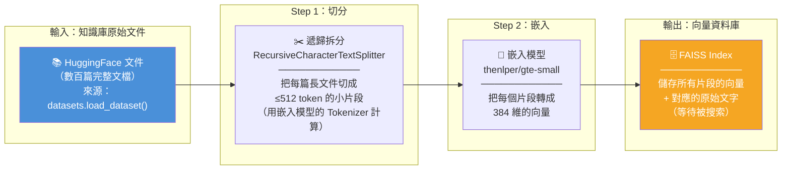

> **這個階段沒有使用者參與。** 它是事前準備工作，目的是把知識庫變成「可被向量搜索」的狀態。你只需要跑一次，之後每次查詢都直接用建好的 FAISS Index。

### 階段 B：線上回答問題（處理的是「使用者的查詢」）

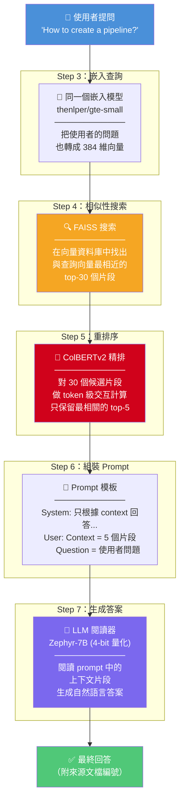

> **關鍵理解**：使用者的查詢和知識庫的片段，是被**同一個嵌入模型**（`thenlper/gte-small`）轉成向量的。正因為它們在同一個向量空間裡，FAISS 才能用數學距離比較「問題」和「片段」之間的相似度。

### 兩個階段的交會點：FAISS 向量資料庫

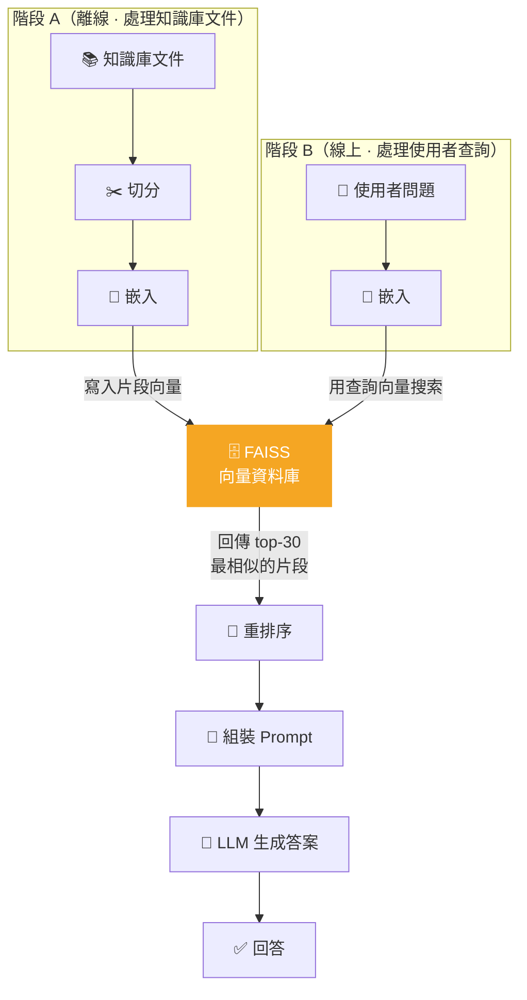

> 上圖清楚顯示：**FAISS 是兩個階段唯一的交會點。** 階段 A 往裡面「寫入」片段向量，階段 B 用查詢向量去「搜索」它。這就是 RAG 的核心機制。

### 常見問題：關於嵌入模型（Embedding Model）

#### Q1：建索引和查詢時，嵌入模型必須是同一個嗎？

**必須是同一個，不能換。** 這是 RAG 系統中最容易犯的錯誤之一。

原因是：每個嵌入模型在訓練時學到的「語義空間」都不一樣。同一句話經過不同模型，會被投射到完全不同的座標位置。用 Model A 建索引、Model B 做查詢，就像拿台北的門牌號碼去東京找地址 — 數字格式一樣，但指向的位置毫無關聯。

```
同一句話 "How to create a pipeline?"

Model A (gte-small)  → [0.12, -0.34, 0.56, ..., 0.78]   ← 384 維空間 A
Model B (bge-large)  → [-0.91, 0.22, -0.05, ..., 0.63]  ← 1024 維空間 B

這兩組向量之間計算餘弦相似度 → 完全沒有意義（甚至維度都不同，根本算不了）
```

原文也明確指出：

> 「當用戶輸入一個查詢時，它會被**之前使用的同一模型**嵌入，並且相似性搜索會返回向量數據庫中最接近的文檔。」

**實務影響**：如果你日後想升級嵌入模型（例如從 `gte-small` 換成更好的 `bge-large`），你必須**用新模型重新嵌入所有知識庫片段、重建整個 FAISS 索引**，不能只換查詢端。

#### Q2：嵌入維度越高，搜尋準確度越高嗎？

**不是簡單的「越高越好」，而是有最佳甜蜜點。**

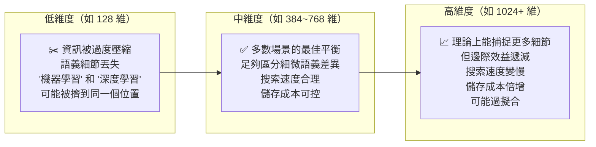

具體來說：

| 因素 | 低維度（128） | 中維度（384-768） | 高維度（1024+） |
|---|---|---|---|
| **語義區分能力** | 較弱，容易混淆相似概念 | 足夠區分大部分語義差異 | 略優，但邊際收益遞減 |
| **搜索速度** | 最快 | 快 | 較慢（向量越長，計算距離越慢） |
| **記憶體 / 儲存** | 最小 | 適中 | 大（1024 維是 384 維的 2.7 倍） |
| **「維度災難」風險** | 低 | 低 | 較高（高維空間中所有點趨向等距） |

> **關鍵認知**：決定搜尋品質的主要因素是**模型的訓練品質**，而非單純的維度數字。一個訓練優秀的 384 維模型（如本文的 `gte-small`），往往比訓練普通的 1024 維模型表現更好。維度只是模型能力的「容器大小」，容器大不代表裝的東西好。
>
> 選擇嵌入模型時，建議直接查看 [MTEB Leaderboard](https://huggingface.co/spaces/mteb/leaderboard) 上的實際評測分數，而非只看維度高低。

#### Q3：Tokenizer 和 Embedding Model 的關係是什麼？

很多人會把 Tokenizer 和 Embedding Model 搞混，或以為它們是同一個東西。其實它們是**同一條流水線上的前後兩步**，缺一不可：

```
人類文字 → 【Tokenizer】 → 數字序列 → 【Model 神經網路】 → 輸出
            (前處理)                      (核心計算)
```

**任何 AI 模型都看不懂文字，只看得懂數字。** 所以在文字進入模型之前，一定要先經過 Tokenizer 轉換。

##### 用一個具體例子走完整條路

假設你要嵌入這句話：`"How to create a pipeline?"`

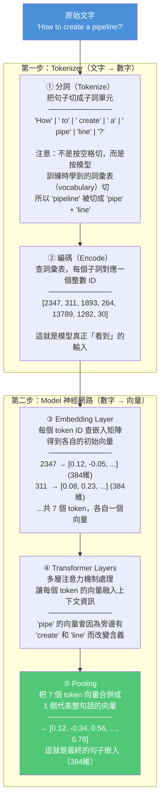

##### 所以 Tokenizer 和 Model 的分工是什麼？

| | **Tokenizer** | **Embedding Model（神經網路）** |
|---|---|---|
| **做什麼** | 把文字切成子詞，再查表轉成整數 ID | 把整數 ID 通過神經網路，計算出語義向量 |
| **本質** | 查表工具（確定性的，不涉及「理解」） | 神經網路（從大量文本中學到的語義理解） |
| **類比** | 像字典的索引頁 — 查「蘋果」在第幾頁 | 像讀完整本字典後理解「蘋果」的含義 |
| **計算量** | 極小（毫秒級，純字串操作） | 大（需要 GPU，矩陣運算） |
| **可替換嗎** | 不行，必須配合對應的模型 | 可以換模型，但 Tokenizer 要跟著換 |

##### 為什麼 Tokenizer 必須和 Model 配套？

每個模型在訓練時都用了一個特定的詞彙表（vocabulary）。例如：

```
gte-small 的詞彙表：   "pipe" = ID 13789,  "line" = ID 1282
Zephyr-7B 的詞彙表：   "pipe" = ID 8580,   "line" = ID 1074
```

如果你用 Zephyr 的 Tokenizer 去切分文字、然後把數字丟給 gte-small 模型，模型查到的嵌入向量就會是**錯誤的** — 因為 ID 8580 在 gte-small 的詞彙表裡可能是一個完全不同的詞。

> 這就像你拿英文字典的頁碼去翻中文字典 — 第 138 頁在英文字典是「apple」，但在中文字典可能是「蝴蝶」。

##### 本文 RAG 系統中的兩組 Tokenizer + Model

本文有**兩個不同的模型**，因此也有**兩個不同的 Tokenizer**，各自配套、互不混用：

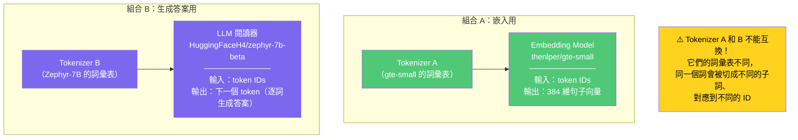

| | 組合 A（嵌入） | 組合 B（生成答案） |
|---|---|---|
| **Tokenizer** | gte-small 的 Tokenizer | Zephyr-7B 的 Tokenizer |
| **Model** | gte-small（嵌入模型） | Zephyr-7B（LLM） |
| **用在哪** | 階段 A 嵌入片段 + 階段 B 嵌入查詢 | 階段 B 格式化 prompt + 生成答案 |
| **輸出** | 384 維向量（用於 FAISS 搜索） | 自然語言文字（用於回答使用者） |

##### 為什麼 LangChain 的程式碼裡看不到 Tokenizer？

你可能注意到，在建向量資料庫時從未明確寫出 Tokenizer：

```python
# 看起來只用了 model，沒有 tokenizer？
embedding_model = HuggingFaceEmbeddings(model_name="thenlper/gte-small")
vector_db = FAISS.from_documents(docs_processed, embedding_model)
```

這是因為 **LangChain 和 Sentence Transformers 在內部自動載入並使用了配套的 Tokenizer** — 你看不到它，但它一直都在。每次呼叫 `embedding_model.embed_query("...")` 時，內部流程其實是：

```
embed_query("How to create a pipeline?")
    └→ tokenizer.encode("How to create a pipeline?")   ← 自動呼叫，你看不到
        └→ [2347, 311, 1893, 264, 13789, 1282, 30]
            └→ model.forward([2347, 311, ...])          ← 神經網路計算
                └→ [0.12, -0.34, 0.56, ..., 0.78]       ← 回傳 384 維向量
```

而 Zephyr-7B 的 Tokenizer 你看得到，是因為你需要手動用它來格式化 prompt（`apply_chat_template()`），所以必須明確載入。

##### 觀念釐清：資料在 RAG 流水線中到底經歷了哪些變換？

以下是常見的誤解與修正，幫助你正確理解整條流水線中「文字、Token、向量」之間的轉換關係。

**常見誤解**：

> ❌ 「FAISS 回傳的向量需要用 Tokenizer 轉回文字」
>
> ❌ 「向量可以反轉還原成原本的文字」

**正確理解**：

- 向量嵌入是**單向壓縮**，不可逆。就像把一本書寫成摘要 — 你可以從書產生摘要，但無法從摘要完美還原整本書。
- FAISS 回傳的不是向量本身，而是**索引位置**（例如「第 42 筆」），再用這個位置直接查回事先保存的原始文字。

完整流程如下：

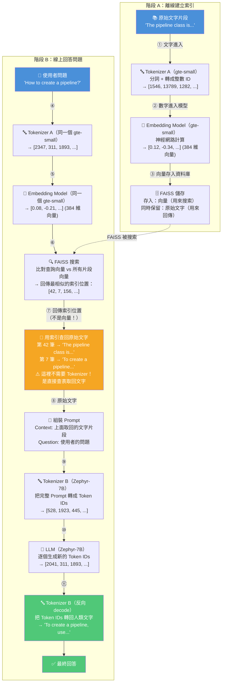

**重點整理**：

| 步驟 | 資料型態 | 誰負責轉換 | 說明 |
|---|---|---|---|
| ① 原始文字 → Token IDs | 文字 → 數字 | Tokenizer A（gte-small） | 嵌入前的必要前處理 |
| ② Token IDs → 向量 | 數字 → 向量 | Embedding Model（gte-small） | 單向壓縮，不可逆 |
| ③ 向量 → 存入 FAISS | 向量 + 原始文字 | FAISS | 向量用來搜索，原始文字保留備查 |
| ⑦ FAISS → 原始文字 | 索引位置 → 文字 | FAISS（直接查表） | **不經過 Tokenizer，不經過反嵌入** |
| ⑨ Prompt → Token IDs | 文字 → 數字 | Tokenizer B（Zephyr-7B） | LLM 推理前的前處理 |
| ⑪ Token IDs → 回答 | 數字 → 文字 | Tokenizer B（Zephyr-7B decode） | **整條流水線中唯一的 decode 步驟** |

> **核心認知**：Tokenizer 的 decode（數字→文字）在整條 RAG 流水線中**只出現一次** — 就是最後 LLM 生成答案的時候。從 FAISS 取回搜索結果時，用的是直接查表，不需要任何 decode。

#### Q4：Embedding 是在做「字詞」的向量，還是「Token」的向量？

**是 Token 的向量，不是字詞的向量。**

Embedding Model 接收的輸入是 Tokenizer 產出的 Token IDs（整數），所以它計算的是每個 **token** 的向量，最後再合併成一個句子向量。而「字詞」和「token」並不是一對一的關係：

```
人類看到的：     "pipeline"              ← 1 個字詞
Tokenizer 切成：  "pipe" + "line"         ← 2 個 tokens
Embedding 計算：   token "pipe" → 向量 A
                   token "line" → 向量 B
                       ↓
                 Transformer 層讓兩個向量互相融入上下文
                       ↓
                 Pooling 合併成 1 個句子向量
```

「字詞」被切成幾個 token，取決於模型的詞彙表：

| 情況 | 字詞 | 被切成的 Tokens | 為什麼 |
|---|---|---|---|
| 常見英文短字 | "the" | → `"the"`（1 個 token） | 太常見，詞彙表直接收錄完整字 |
| 長英文字 | "pipeline" | → `"pipe"` + `"line"`（2 個 tokens） | 拆成更小的子詞單元 |
| 中文字 | "機器學習" | → `"機"` + `"器"` + `"學"` + `"習"`（可能 4+ 個 tokens） | 中文字常被拆成單字或 byte-level tokens，視模型而定 |
| 罕見專有名詞 | "HuggingFace" | → `"Hu"` + `"gging"` + `"Face"`（3 個 tokens） | 越罕見越容易被拆碎 |

> **所以更精準的說法是**：Embedding Model 對每個 token 計算一個向量，再透過 Transformer 的注意力機制讓 token 之間互相交換上下文資訊，最後用 Pooling 合併成一個代表整句話的句子向量。它處理的最小單位是 token，不是字詞。

#### Q5：為什麼呼叫 LLM 的 API 時，不需要自己處理 Tokenizer？

如果你用過 Claude API、OpenAI API 或 Gemini API，你會發現只要傳入一段文字 prompt，就直接拿到文字回答，完全沒碰到 Tokenizer。這是因為 **Tokenizer 不是不存在，而是被 API 伺服器藏在內部自動執行了**：

```
你以為的 API 流程：
  prompt 文字 ──→ [ API ] ──→ 回答文字

實際的 API 內部流程：
  prompt 文字 → [Tokenizer encode] → Token IDs → [LLM 推理] → Token IDs → [Tokenizer decode] → 回答文字
               ╰───────────────────── API 伺服器內部自動處理，你看不到 ─────────────────────╯
```

其實不只是雲端 API，本文的 `pipeline()` 封裝也是一樣的道理：

| 使用方式 | 誰執行 Tokenizer | 你看得到嗎 |
|---|---|---|
| **呼叫雲端 API**（Claude、Gemini、OpenAI） | API 伺服器在內部自動執行 | 看不到，你只送出文字、收到文字 |
| **用 `pipeline()` 跑本地模型**（本文的做法） | pipeline 在內部自動執行 | 看不到，pipeline 封裝了整個流程 |
| **手動載入本地模型** | 你自己載入並執行 | 看得到，你要自己寫 `tokenizer.encode()` / `decode()` |

> 就像你去餐廳點餐，你只說「一碗牛肉麵」，廚房內部的備料、切菜、下鍋你都看不到。但不代表這些步驟不存在 — 只是被封裝在「餐廳服務」裡了。

#### Q6：如果 LLM 改用雲端 API（如 Gemini），我是不是就可以完全忽略 Tokenizer？

**只對一半。** 你的 RAG 系統裡有**兩組** Tokenizer + Model 的配對，換成雲端 API 只解決了其中一組：

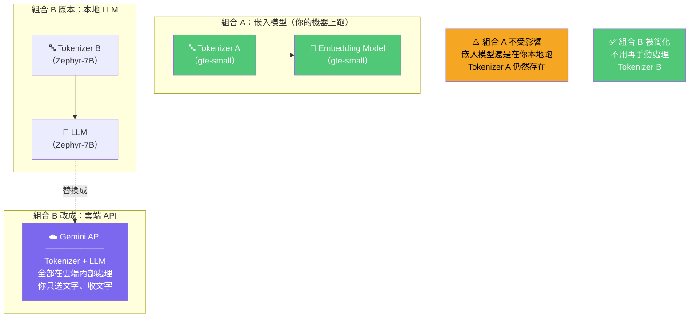

| | 組合 A：嵌入模型（gte-small） | 組合 B：LLM 閱讀器 |
|---|---|---|
| **換成雲端 API 後** | ❌ 還是要處理 — 嵌入模型還是在你本地跑 | ✅ 可以忽略 — Gemini API 內部幫你做完 |
| **Tokenizer 狀態** | 仍然在本地切分和嵌入時自動被使用 | 你的程式碼中不再需要出現 |

**換成雲端 API 後，程式碼的變化**：

```python
# ===== 改之前：本地 Zephyr-7B =====
# 你需要手動載入 Tokenizer + Model（兩者缺一不可）
tokenizer = AutoTokenizer.from_pretrained("HuggingFaceH4/zephyr-7b-beta")  # 載入 Tokenizer
model = AutoModelForCausalLM.from_pretrained("HuggingFaceH4/zephyr-7b-beta", ...)  # 載入 LLM
# 你需要手動用 Tokenizer 把 prompt 格式化成模型要求的聊天模板
RAG_PROMPT_TEMPLATE = tokenizer.apply_chat_template(prompt_in_chat_format, ...)
# 透過 pipeline 執行（pipeline 內部自動處理 encode → 推理 → decode）
answer = READER_LLM(final_prompt)[0]["generated_text"]

# ===== 改之後：雲端 Gemini API =====
# 不需要載入 Tokenizer，不需要載入 Model — 全部在雲端處理
# 不需要 apply_chat_template() — API 自己知道怎麼處理 prompt 格式
import google.generativeai as genai
genai.configure(api_key="YOUR_API_KEY")              # 設定 API 金鑰
gemini = genai.GenerativeModel("gemini-2.5-pro")     # 指定要用的模型
# 直接丟文字進去，拿回文字答案（Tokenizer 在 API 內部自動處理，你看不到）
answer = gemini.generate_content(final_prompt).text
```

**但即使用了雲端 API，你仍然需要理解 token 的概念**，因為：

| 你需要關心的事 | 為什麼 |
|---|---|
| **Context window 上限** | 每個 API 都有 token 上限（如 Gemini 2.5 Pro 為 1M tokens）。你塞進去的 prompt（上下文片段 + 問題）不能超過此限制 |
| **費用計算** | 雲端 API 按 **token 數**收費。prompt 越長（塞越多片段），花越多錢。了解 token 才能估算成本 |
| **嵌入模型的切分** | 嵌入模型的 `max_seq_length`（如 512 tokens）限制仍然存在。切片段時還是需要 Tokenizer 來計算長度，這一步不會因為 LLM 換成 API 而消失 |

> **一句話總結**：換成雲端 API，你**寫程式時**可以不碰 LLM 的 Tokenizer（少寫很多程式碼）；但**腦袋裡**要知道 token 是什麼，因為它影響你的 context window 上限、API 費用、和片段切分策略。嵌入模型那一端的 Tokenizer 則完全不受影響。

---

## 三、Hugging Face 在這個 RAG 中扮演什麼角色？

在動手之前，先搞清楚一個根本問題：**我們到底從 Hugging Face 拿了什麼？為什麼需要它？**

### 3.0.1 總覽：四樣東西，各司其職

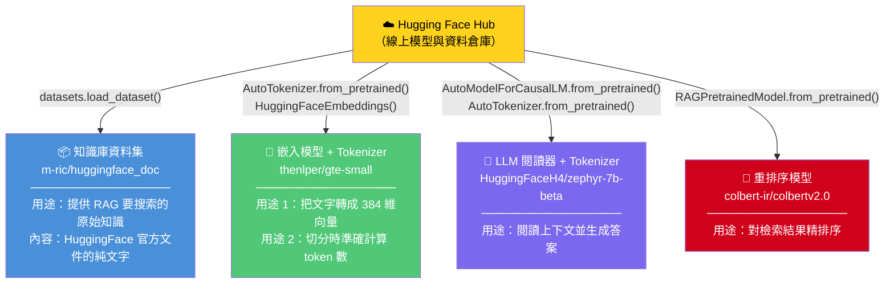

### 3.0.2 逐一解析：每樣東西為什麼不可或缺

#### (1) 知識庫資料集 — RAG 要搜索的「外部大腦」 `📌 階段 A：離線建立索引`

```python
# 從 HuggingFace Hub 下載 HuggingFace 官方文件資料集（作為 RAG 的知識庫）
ds = datasets.load_dataset("m-ric/huggingface_doc", split="train")
```

| 問題 | 回答 |
|---|---|
| **落在哪個階段？** | **階段 A（離線建立索引）** — 這是整個流水線的起點，在任何使用者提問之前就要準備好 |
| **拿到什麼？** | 一個已整理好的資料集，每筆包含 `text`（文件內容）和 `source`（來源 URL） |
| **為什麼需要？** | RAG 的核心就是「從外部知識檢索」，這個資料集就是那個「外部知識」 |
| **能替換嗎？** | 完全可以。換成你自己的 PDF、網頁爬蟲結果、公司內部文件都行。`datasets` 庫只是一個方便的資料載入工具 |

#### (2) 嵌入模型 — 把文字翻譯成「語義座標」 `📌 階段 A + 階段 B 都用到`

```python
# 載入嵌入模型（把文字轉成 384 維向量，用於 FAISS 相似性搜索）
embedding_model = HuggingFaceEmbeddings(model_name="thenlper/gte-small")
```

| 問題 | 回答 |
|---|---|
| **落在哪個階段？** | **兩個階段都用到**。階段 A 用它把知識庫片段轉成向量存入 FAISS；階段 B 用它把使用者查詢轉成向量去 FAISS 搜索。兩邊必須用同一個模型（見前面 Q1 說明） |
| **拿到什麼？** | 一個預訓練好的句子嵌入模型，能把任意文字轉成 384 維向量 |
| **為什麼需要？** | FAISS 只能搜索向量，不能搜索文字。你需要這個模型把文字「翻譯」成向量，才能做數學上的相似性搜索 |
| **它還有第二個用途** | 它的 tokenizer 在**階段 A 的切分步驟**中被用來準確計算每個片段的 token 數，確保不超過模型的 512 token 上限 |

#### (3) LLM 閱讀器 — 讀懂上下文並生成人話答案 `📌 階段 B：線上回答問題`

```python
# 從 HuggingFace Hub 下載 Zephyr-7B 語言模型（負責閱讀上下文並生成答案）
model = AutoModelForCausalLM.from_pretrained("HuggingFaceH4/zephyr-7b-beta", ...)
# 下載配套的 Tokenizer（負責文字 ↔ Token IDs 轉換 + prompt 聊天模板格式化）
tokenizer = AutoTokenizer.from_pretrained("HuggingFaceH4/zephyr-7b-beta")
```

| 問題 | 回答 |
|---|---|
| **落在哪個階段？** | **階段 B（線上回答問題）** — 只有在使用者提問、檢索完畢後才登場，負責最後的答案生成 |
| **拿到什麼？** | 一個 7B 參數的語言生成模型（Zephyr-7B），加上它配套的 tokenizer |
| **為什麼需要？** | 檢索器只負責「找到相關片段」，你還需要一個 LLM 來「讀懂這些片段並組織成自然語言回答」 |

**LLM 閱讀器的 Tokenizer 到底在做什麼？**

Tokenizer 是 LLM 的「翻譯員」— LLM 看不懂人類文字，只看得懂數字序列（token IDs）。Tokenizer 負責**雙向轉換**：

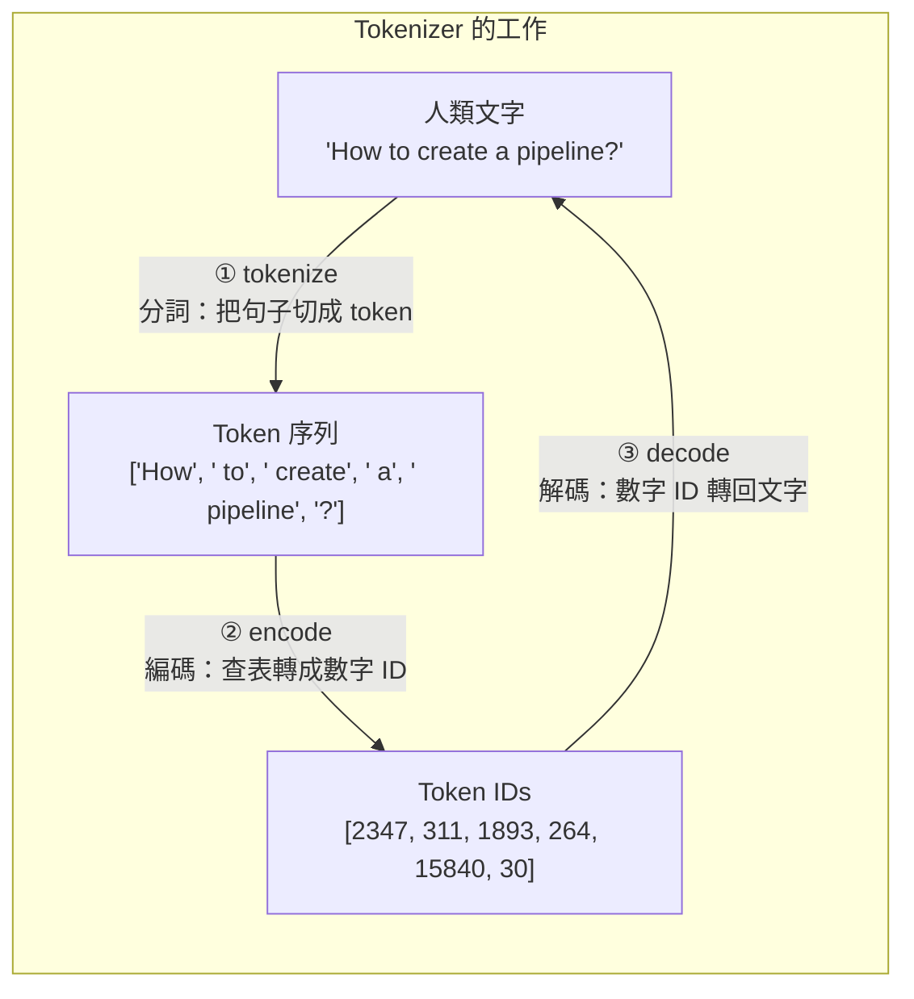

在本文的 RAG 系統中，Zephyr-7B 的 Tokenizer 負責**兩件關鍵任務**：

**任務一：將 Prompt 格式化為聊天模板（Chat Template）**

每個 LLM 都有自己要求的 prompt 格式。Zephyr-7B 要求用 `<|system|>`、`<|user|>`、`<|assistant|>` 這些特殊標記區分角色。Tokenizer 的 `apply_chat_template()` 方法會自動處理這件事：

```python
# 你寫的是結構化的對話
prompt_in_chat_format = [
    {"role": "system", "content": "只根據 context 回答..."},
    {"role": "user", "content": "Context: ...\nQuestion: ..."},
]

# Tokenizer 自動轉成模型要求的格式
RAG_PROMPT_TEMPLATE = tokenizer.apply_chat_template(
    prompt_in_chat_format, tokenize=False, add_generation_prompt=True
)

# 輸出結果：
# <|system|>
# 只根據 context 回答...
# <|user|>
# Context: ...
# Question: ...
# <|assistant|>         ← add_generation_prompt=True 自動加上這個，告訴模型「該你回答了」
```

> 如果你不用 `apply_chat_template()` 而是自己手動拼字串，很容易漏掉特殊標記或格式不對，導致模型行為異常（例如不遵守指令、重複輸出、或生成亂碼）。

**任務二：將完整 Prompt 轉成模型可處理的 Token IDs**

當你呼叫 `READER_LLM(final_prompt)` 時，pipeline 內部會自動用 Tokenizer 完成以下步驟：

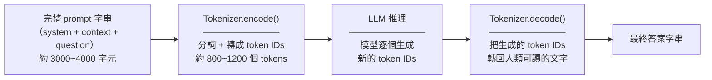

**一句話總結**：沒有 Tokenizer，LLM 就像一個只懂數字的外國人 — 你說的話它聽不懂，它說的數字你也看不懂。Tokenizer 就是中間的翻譯員，同時還負責幫你把信件（prompt）按照對方要求的格式裝進信封（chat template）。

#### (4) 重排序模型 — 對檢索結果做精排 `📌 階段 B：線上回答問題`

```python
# 從 HuggingFace Hub 下載 ColBERTv2 重排序模型（用 token 級交互對檢索結果精排序）
RERANKER = RAGPretrainedModel.from_pretrained("colbert-ir/colbertv2.0")
```

| 問題 | 回答 |
|---|---|
| **落在哪個階段？** | **階段 B（線上回答問題）** — 在 FAISS 粗檢索之後、組裝 Prompt 之前，對候選片段精排序 |
| **拿到什麼？** | ColBERTv2 延遲交互模型的預訓練權重 |
| **為什麼需要？** | 嵌入模型的初步檢索「大方向對但排序粗糙」，ColBERTv2 用 token 級交互重新排序，把最相關的片段排到最前面 |

### 3.0.2.5 總覽：四個 HF 組件分別落在哪個階段？

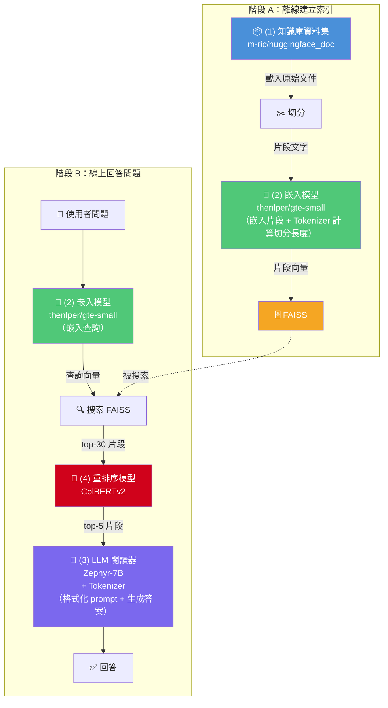

| HF 組件 | 階段 A（離線） | 階段 B（線上） | 說明 |
|---|---|---|---|
| **(1) 知識庫資料集** | ✅ | — | 只在建索引時載入一次 |
| **(2) 嵌入模型** | ✅ 嵌入片段 + Tokenizer 算切分長度 | ✅ 嵌入使用者查詢 | 唯一橫跨兩個階段的組件 |
| **(3) LLM 閱讀器** | — | ✅ | 只在回答問題時登場（Tokenizer 負責格式化 prompt + 文字↔數字轉換） |
| **(4) 重排序模型** | — | ✅ | 只在回答問題時登場（FAISS 搜索之後、LLM 之前） |

### 3.0.3 哪些不是來自 Hugging Face？

| 工具 | 來源 | 角色 |
|---|---|---|
| **FAISS** | Facebook Research（獨立開源） | 向量搜索引擎，在本地執行 |
| **LangChain** | LangChain Inc.（獨立開源） | RAG 流水線框架，負責串接所有組件 |
| **BitsAndBytes** | Tim Dettmers（獨立開源） | 4-bit 量化工具，降低 LLM 顯存需求 |
| **RAGatouille** | Benjamin Clavié（獨立開源） | ColBERTv2 的易用封裝（模型權重來自 HF，但庫本身不是） |
| **PaCMAP** | 學術研究（獨立開源） | 嵌入視覺化的降維工具 |

### 3.0.4 一句話總結

> **Hugging Face Hub = 模型和資料的倉庫。** 你從上面下載預訓練好的嵌入模型、LLM、重排序模型、和資料集，然後在本地用 LangChain + FAISS 組裝成 RAG 流水線。如果你有自己的模型和資料，完全可以不依賴 Hugging Face — 它是方便，但不是必要。

---

## 四、各環節深度解析（對應上方 Hugging Face 四大組件）

### 4.1 文檔切分（Chunking）— 一切的地基 `← 使用 HF 組件 (2) 的 Tokenizer`

#### 原理

LLM 不能一次讀完整個知識庫，所以我們必須把文件切成小片段（chunks），之後才能搜索、嵌入、餵給模型。

切分品質直接決定後續所有環節的上限 — 切壞了，後面怎麼優化都救不回來。

#### 核心矛盾

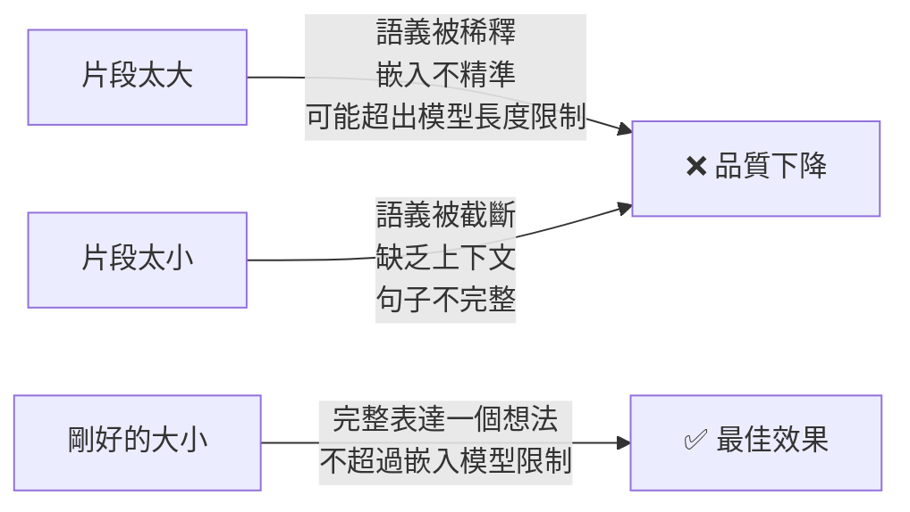

#### 遞歸拆分（Recursive Splitting）的運作方式

這不是簡單地每 N 個字切一刀，而是**按照語義邊界的重要性逐級嘗試**：

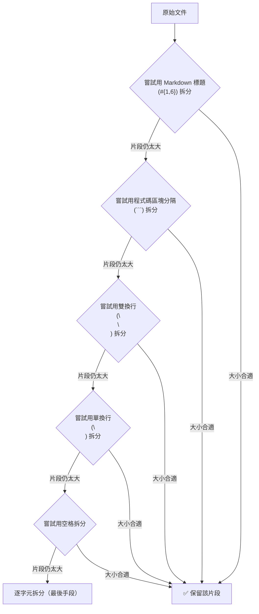

原文實際使用的是**針對 Markdown 文件的分隔符清單**（非簡化版的 `["\n\n", "\n", ".", ""]`）：

```python
MARKDOWN_SEPARATORS = [
    "\n#{1,6} ",      # Markdown 標題（最重要的語義邊界）
    "```\n",          # 程式碼區塊
    "\n\\*\\*\\*+\n", # 水平線 ***
    "\n---+\n",       # 水平線 ---
    "\n___+\n",       # 水平線 ___
    "\n\n",           # 段落
    "\n",             # 換行
    " ",              # 空格
    "",               # 逐字元（最後手段）
]
```

#### 關鍵陷阱：字元數 ≠ Token 數

`RecursiveCharacterTextSplitter` 預設以**字元數**計算 chunk_size，但嵌入模型的限制是以 **token 數**計算的。一個中文字可能是 2-3 個 tokens，所以用字元數控制會導致片段超出模型限制而被截斷。

**解法**：改用 `from_huggingface_tokenizer()` 工廠方法，讓切分器用 tokenizer 計算長度：

```python
text_splitter = RecursiveCharacterTextSplitter.from_huggingface_tokenizer(
    AutoTokenizer.from_pretrained("thenlper/gte-small"),
    chunk_size=512,          # 以 token 數計算，配合模型的 max_seq_length
    chunk_overlap=51,        # ~1/10 的重疊
    separators=MARKDOWN_SEPARATORS,
)
```

#### 參數調整指南

| 參數 | 建議值 | 原因 |
|---|---|---|
| `chunk_size` | ≤ 嵌入模型的 `max_seq_length`（如 512） | 超過會被截斷，丟失資訊 |
| `chunk_overlap` | chunk_size 的 1/10 | 減少想法在邊界處被切斷的機率 |
| `top_k` | 5-30（搜索時取多，最終保留少） | 射更多箭提高命中率，但別淹沒 LLM |

---

### 4.2 嵌入與向量資料庫 — 把文字變成可搜索的數學 `← 使用 HF 組件 (2) 嵌入模型`

#### 嵌入的直覺理解

嵌入模型把一段文字壓縮成一個高維向量（例如 384 維）。語義相近的文字，在向量空間中的距離也相近。

```
"如何建立 pipeline" → [0.12, -0.34, 0.56, ..., 0.78]  (384維)
"pipeline 的建立方法" → [0.11, -0.33, 0.55, ..., 0.77]  ← 很近！
"今天天氣很好"      → [-0.89, 0.45, -0.12, ..., 0.03]  ← 很遠
```

#### 距離度量比較

| 度量方式 | 公式直覺 | 適用場景 | 是否需歸一化 |
|---|---|---|---|
| **餘弦相似度** | 兩向量夾角的 cos 值 | 只關心方向（語義），不關心幅度 | 是 |
| **點積** | 方向 × 幅度 | 幅度有意義時（如文件重要性） | 否 |
| **歐氏距離** | 兩點間直線距離 | 通用 | 建議 |

> **實務結論**：歸一化後，三者差異很小。本文選用**餘弦相似度**，是最穩健的預設選擇。

#### 什麼是「歸一化」（Normalization）？

上面的表格多次提到「歸一化」，這到底是什麼意思？

**歸一化（L2 Normalization）就是把向量的長度縮放到 1，只保留方向、丟掉長度。**

用一個簡單的 2 維例子來理解：

```
原始向量 A = [3, 4]       長度 = √(3² + 4²) = 5
歸一化後 A = [0.6, 0.8]   長度 = √(0.6² + 0.8²) = 1  ← 方向不變，長度變成 1

原始向量 B = [6, 8]       長度 = √(6² + 8²) = 10
歸一化後 B = [0.6, 0.8]   長度 = √(0.6² + 0.8²) = 1  ← 跟 A 方向完全一樣！
```

A 和 B 原本長度不同（5 vs 10），但**方向完全一樣**。歸一化後它們變成同一個向量 — 因為歸一化只保留方向、丟掉長度。

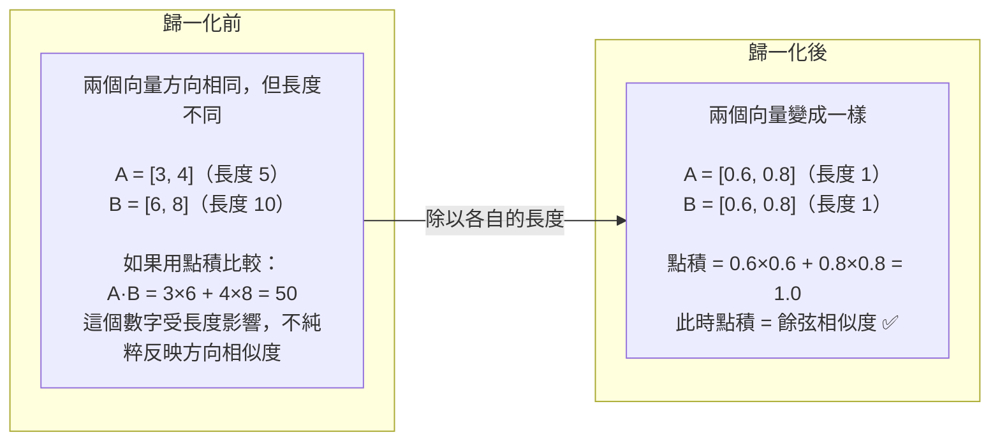

##### 為什麼 RAG 裡需要歸一化？

因為我們用的是**餘弦相似度**，它只關心「兩個向量的方向有多接近」，不關心長度。而長度在語義搜索中通常沒有意義 — 一個片段的向量比較長，不代表它語義上更重要，可能只是片段的文字比較多。

歸一化帶來一個重要的**計算優化**：

| | 沒有歸一化 | 歸一化之後 |
|---|---|---|
| **要算餘弦相似度** | cos(A, B) = (A·B) / (‖A‖ × ‖B‖)，每次都要算三樣東西 | cos(A, B) = A·B，**點積直接就是餘弦相似度** |
| **FAISS 可以用** | 必須用專門的餘弦相似度索引 | 直接用更快的內積索引（`IndexFlatIP`） |
| **計算速度** | 較慢 | 較快 |

##### 在程式碼中的對應位置

```python
# 嵌入模型：產出向量時自動歸一化
embedding_model = HuggingFaceEmbeddings(
    model_name="thenlper/gte-small",
    encode_kwargs={"normalize_embeddings": True},  # ← 就是這行，開啟歸一化
)
# 每個向量產出後都會被除以自身的長度，變成長度為 1 的單位向量

# FAISS：設定使用餘弦相似度（內部實際用歸一化後的內積來實現）
KNOWLEDGE_VECTOR_DATABASE = FAISS.from_documents(
    docs_processed, embedding_model, distance_strategy=DistanceStrategy.COSINE
)
```

> **一句話總結**：歸一化 = 把向量長度統一縮放到 1，只保留方向。這讓「點積」直接等於「餘弦相似度」，FAISS 搜索更快，而且避免了「長向量」和「短向量」之間不公平的比較。

#### FAISS 向量資料庫 — 深入介紹

##### 什麼是 FAISS？

**FAISS（Facebook AI Similarity Search）** 是 Meta（原 Facebook）AI Research 團隊開源的向量相似性搜索引擎。它解決一個核心問題：

> 給定一個查詢向量，如何在**數百萬甚至數十億筆**向量中，快速找到最相近的 k 筆？

如果用暴力搜索（逐一比對每筆向量），100 萬筆 384 維向量大約需要幾秒鐘 — 聽起來還行，但如果是 1 億筆、而且每秒要處理上千次查詢呢？FAISS 就是為了解決這個規模問題而生的。

##### FAISS 的核心特性

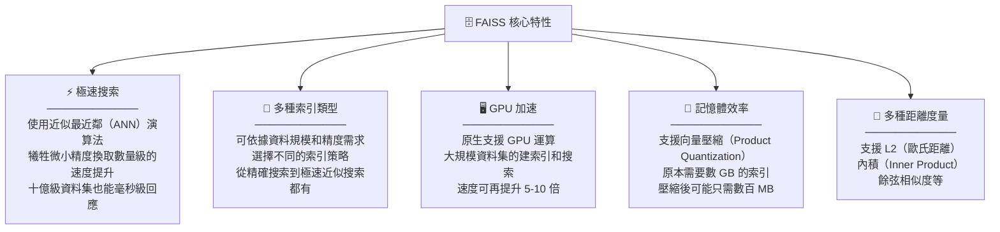

##### FAISS 索引類型：怎麼選？

FAISS 提供多種索引類型，核心取捨是**精度 vs 速度 vs 記憶體**：

| 索引類型 | 搜索方式 | 精度 | 速度 | 記憶體 | 適用場景 |
|---|---|---|---|---|---|
| **`IndexFlatL2`** / **`IndexFlatIP`** | 暴力搜索（逐一比對） | 100%（精確） | 慢（資料量大時） | 高（存完整向量） | 資料量 < 10 萬筆，或作為精度基準 |
| **`IndexIVFFlat`** | 先分群，只搜索最近的幾個群 | 很高（~95-99%） | 快 | 高 | 10 萬 ~ 100 萬筆 |
| **`IndexIVFPQ`** | 分群 + 向量壓縮 | 高（~90-95%） | 很快 | 低（壓縮後） | 100 萬 ~ 10 億筆（記憶體有限時） |
| **`IndexHNSWFlat`** | 圖搜索（HNSW 演算法） | 很高（~97-99%） | 很快 | 高 | 需要高精度又要快的場景 |

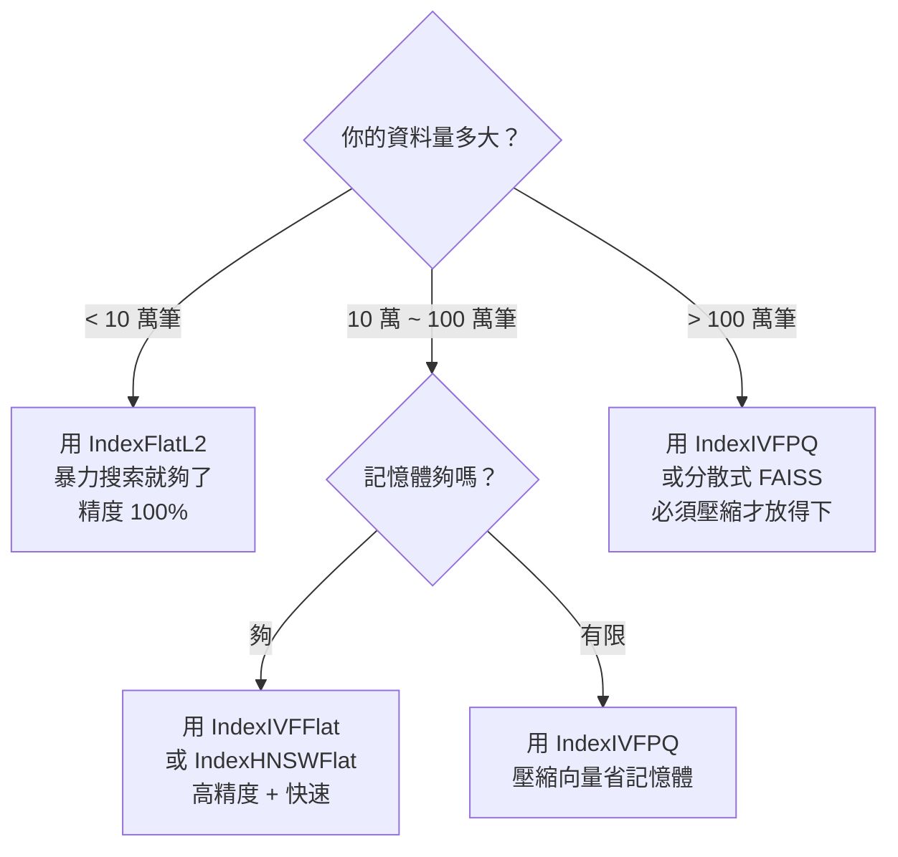

##### 在本文 RAG 中怎麼用 FAISS？

本文透過 **LangChain 的 FAISS 封裝** 使用，不需要直接操作底層 API：

```python
from langchain.vectorstores import FAISS
from langchain_community.embeddings import HuggingFaceEmbeddings
from langchain_community.vectorstores.utils import DistanceStrategy

# 1. 準備嵌入模型
embedding_model = HuggingFaceEmbeddings(
    model_name="thenlper/gte-small",
    encode_kwargs={"normalize_embeddings": True},  # 餘弦相似度需歸一化
)

# 2. 一行建立索引（LangChain 自動處理：嵌入所有片段 → 建立 FAISS 索引 → 存入）
vector_db = FAISS.from_documents(
    docs_processed,                          # 切好的知識庫片段
    embedding_model,                         # 嵌入模型
    distance_strategy=DistanceStrategy.COSINE  # 距離度量
)

# 3. 搜索（LangChain 自動處理：嵌入查詢 → FAISS 搜索 → 回傳原始文字）
results = vector_db.similarity_search(query="How to create a pipeline?", k=30)
```

> LangChain 在底層實際建立的是 `IndexFlatIP`（精確內積搜索），搭配歸一化向量等同於餘弦相似度。對本文的知識庫規模（數千至數萬筆片段）而言，暴力搜索已經足夠快，不需要使用近似索引。

##### 如果不透過 LangChain，直接用 FAISS 原生 API？

```python
import faiss
import numpy as np

dimension = 384  # 向量維度（必須與嵌入模型的輸出維度一致，gte-small = 384）

# 1. 建立索引（IndexFlatIP = 精確內積搜索，搭配歸一化後等同於餘弦相似度）
index = faiss.IndexFlatIP(dimension)

# 2. 加入向量
vectors = np.array([...], dtype="float32")  # 你的嵌入向量，shape: [片段數量, 384]
faiss.normalize_L2(vectors)                  # 歸一化：把每個向量的長度縮放到 1
index.add(vectors)                           # 加入索引（之後就可以被搜索）

# 3. 搜索
query_vector = np.array([[...]], dtype="float32")  # 查詢向量，shape: [1, 384]
faiss.normalize_L2(query_vector)                    # 查詢向量也要歸一化（跟索引中的向量一致）
distances, indices = index.search(query_vector, k=30)  # 搜索最相似的 top-30

# 搜索結果解讀：
# indices[0] → [7, 42, 156, ...]              ← 最相似片段在原始資料中的索引位置
# distances[0] → [0.95, 0.89, 0.87, ...]      ← 對應的相似度分數（1.0 = 完全相同）
# 用 indices 回去查原始文字：original_texts[indices[0][0]] → 取回第 7 筆的原始文字
```

##### FAISS vs 其他向量資料庫

| | **FAISS** | **Chroma** | **Pinecone** | **Weaviate** | **Milvus** |
|---|---|---|---|---|---|
| **類型** | 函式庫（Library） | 輕量資料庫 | 雲端託管服務 | 開源資料庫 | 開源資料庫 |
| **部署方式** | 嵌入程式碼中 | 本地 / 嵌入 | 雲端 API | 本地 / 雲端 | 本地 / 雲端 |
| **持久化** | 需自行存檔 | 內建 | 雲端自動 | 內建 | 內建 |
| **篩選（Metadata Filtering）** | 不支援 | 支援 | 支援 | 支援 | 支援 |
| **規模上限** | 十億級 | 百萬級 | 十億級 | 十億級 | 十億級 |
| **學習門檻** | 低（幾行程式碼） | 很低 | 低（API） | 中 | 中 |
| **適合場景** | 研究、原型、嵌入式 | 快速原型、小專案 | 生產環境、免運維 | 生產環境 | 大規模生產環境 |

> **本文選擇 FAISS 的原因**：作為教學範例，FAISS 最輕量、不需要額外服務、幾行程式碼就能跑起來。如果要上線到生產環境，通常會考慮 Pinecone（免運維）或 Milvus（可自建、支援篩選）。

---

### 4.3 重排序（Reranking）— 精排的關鍵一步 `← 使用 HF 組件 (4) ColBERTv2`

#### 為什麼需要重排序？

嵌入模型（Bi-encoder）為了速度，對查詢和文檔**分別編碼**，無法捕捉兩者之間的細粒度交互。這導致初步檢索的結果「大方向對，但排序不夠精準」。

#### ColBERTv2 的工作原理

原文將 ColBERTv2 稱為「交叉編碼器」，因為它與傳統的 Bi-encoder 不同，能計算查詢 token 與文檔 token 之間更細緻的交互。更精確地說，ColBERTv2 採用的是**延遲交互（Late Interaction）** 架構，介於 Bi-encoder 和 Cross-encoder 之間 — 它對查詢和文檔分別編碼（像 Bi-encoder），但在比對時做 token 級的交互計算（像 Cross-encoder）：

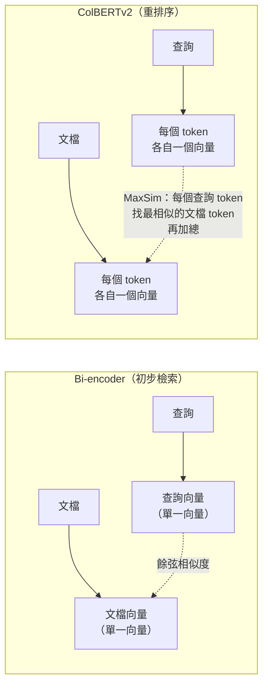

- **Bi-encoder**：整段文字壓成 1 個向量，速度快但粗糙
- **ColBERTv2**：每個 token 各自一個向量，計算 token 級別的交互（MaxSim），更精準但較慢
- **策略**：先用 Bi-encoder 粗篩 30 篇，再用 ColBERTv2 精排保留 5 篇

---

### 4.4 LLM 閱讀器 — 最終生成答案 `← 使用 HF 組件 (3) Zephyr-7B`

#### 模型選擇考量

- 模型：`HuggingFaceH4/zephyr-7b-beta`
- **上下文長度**需足夠：5 篇 × 512 tokens = 2,560 tokens + prompt ≈ 至少需要 **4K tokens** 的上下文窗口
- 使用 **4-bit 量化**（BitsAndBytes NF4）大幅降低顯存需求，讓 7B 模型可在單張 GPU 上運行

#### Prompt 設計原則

原文使用的 prompt 遵循幾個關鍵原則：

1. **限定範圍**：「只根據 context 回答」— 防止 LLM 用自己的知識幻覺
2. **簡潔要求**：「回答應簡潔且相關」— 避免冗長輸出
3. **引用來源**：「提供來源文檔編號」— 增加可追溯性
4. **拒答機制**：「無法從 context 推導則不要回答」— 寧可不答也不要瞎編

---

### 4.5 完整流水線：端到端流程

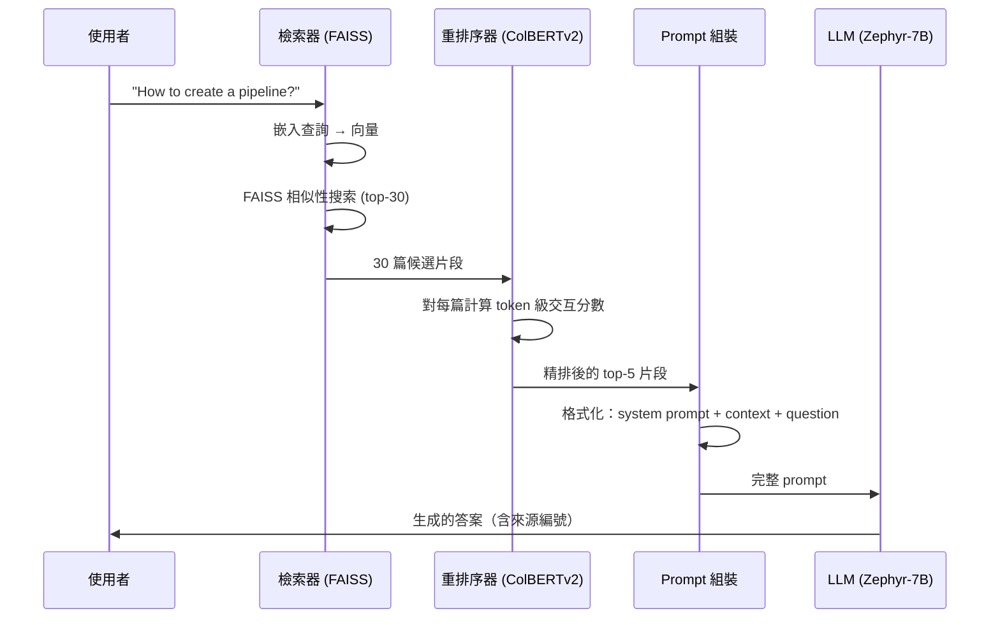

---

## 五、使用的主要工具與庫

| 工具/庫 | 角色 | 為什麼選它 |
|---|---|---|
| **LangChain** | RAG 框架 | 豐富的向量資料庫選項，保留文件元資料 |
| **FAISS** | 向量搜索引擎 | Facebook 出品，快速且廣泛支援 |
| **Sentence Transformers** (`thenlper/gte-small`) | 嵌入模型 | 輕量（384 維），max_seq_length=512 |
| **Transformers** + **BitsAndBytes** | LLM 推理 | 4-bit 量化，降低顯存需求 |
| **RAGatouille** + **ColBERTv2** | 重排序 | 延遲交互模型，token 級精排 |
| **PaCMAP** | 嵌入視覺化 | 降維效果優於 t-SNE/UMAP，速度快 |

---

## 六、進一步優化方向

| 優化方向 | 具體做法 | 預期效果 |
|---|---|---|
| **建立評估流水線** | 構建小型 QA 評估集，量化 Recall / F1 / BLEU | 所有優化的前提，沒有度量就無法改進 |
| **語義切分** | 用 `SemanticChunker` 按語義邊界而非固定大小切分 | 片段語義更完整 |
| **更換嵌入模型** | 參考 [MTEB Leaderboard](https://huggingface.co/spaces/mteb/leaderboard) | 檢索精度提升 |
| **查詢擴展** | 用 LLM 改寫查詢，生成多個變體 | 提高召回率 |
| **上下文壓縮** | 只保留片段中與查詢最相關的句子 | 減少雜訊，緩解「中間丟失」 |
| **多輪對話** | 加入對話歷史管理 | 支援追問和澄清 |

---

## 七、一步一步實作指南

以下是可以直接在 Jupyter Notebook 或 Colab 中執行的完整步驟。

### Step 0：環境準備

```bash
pip install torch transformers accelerate bitsandbytes \
    langchain langchain-community \
    sentence-transformers faiss-gpu \
    datasets ragatouille pacmap plotly pandas
```

### Step 1：載入知識庫 `← HF 組件 (1) 資料集`

> **從 HF 拿什麼**：`m-ric/huggingface_doc` 資料集 — HuggingFace 官方文件的純文字集合，作為 RAG 的外部知識來源。

```python
import datasets
from langchain.docstore.document import Document as LangchainDocument

# 從 HuggingFace Hub 下載知識庫資料集（HuggingFace 官方文件集合）
ds = datasets.load_dataset("m-ric/huggingface_doc", split="train")

# 將每筆資料轉成 LangchainDocument 物件
# page_content：文件內容（會被切分、嵌入、搜索）
# metadata：附加資訊（來源 URL，不參與嵌入，但會一路保留供最終引用）
RAW_KNOWLEDGE_BASE = [
    LangchainDocument(page_content=doc["text"], metadata={"source": doc["source"]})
    for doc in ds
]
print(f"共載入 {len(RAW_KNOWLEDGE_BASE)} 篇文檔")
```

**為什麼要轉成 `LangchainDocument`？**

從 HuggingFace Datasets 載入的資料是普通的 Python 字典（`{"text": "...", "source": "..."}`）。我們把它轉成 LangChain 的 `Document` 物件，是因為這個物件把資料拆成兩個欄位：

| 欄位 | 內容 | 在 RAG 流程中的用途 |
|---|---|---|
| `page_content` | 文件的純文字內容 | 被切分、嵌入、存入 FAISS，最終塞進 Prompt 給 LLM 閱讀 |
| `metadata` | 附加資訊（如 `{"source": "huggingface/transformers/..."}` ） | **不參與嵌入和搜索**，但會一路跟隨片段保留下來，讓你在最終回答時可以標註「這段資訊來自哪篇文件」 |

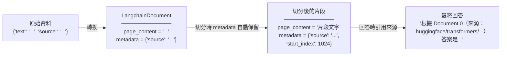

> 如果不用 `LangchainDocument` 而是自己用純字串處理，你在切分後就會丟失「這個片段來自哪篇文件」的資訊，最終無法在回答中標註來源。

### Step 2：定義切分函式（以 token 數控制大小） `← HF 組件 (2) 的 Tokenizer`

> **從 HF 拿什麼**：`thenlper/gte-small` 的 Tokenizer — 用來在切分時以 token 數（而非字元數）計算片段長度，確保不超過嵌入模型的 512 token 上限。

```python
from typing import Optional, List
from langchain.text_splitter import RecursiveCharacterTextSplitter
from transformers import AutoTokenizer

# 嵌入模型名稱（後續切分和嵌入都會用到同一個模型）
EMBEDDING_MODEL_NAME = "thenlper/gte-small"

# 針對 Markdown 文件的分隔符清單（按語義重要性由高到低排列）
MARKDOWN_SEPARATORS = [
    "\n#{1,6} ",      # Markdown 標題（最重要的語義邊界）
    "```\n",          # 程式碼區塊邊界
    "\n\\*\\*\\*+\n", # 水平線 ***
    "\n---+\n",       # 水平線 ---
    "\n___+\n",       # 水平線 ___
    "\n\n",           # 段落分隔
    "\n",             # 換行
    " ",              # 空格
    "",               # 逐字元拆分（最後手段）
]

def split_documents(
    chunk_size: int,                                    # 每個片段的最大 token 數
    knowledge_base: List[LangchainDocument],            # 原始知識庫文件清單
    tokenizer_name: Optional[str] = EMBEDDING_MODEL_NAME,  # 用哪個模型的 tokenizer 計算長度
) -> List[LangchainDocument]:
    """將知識庫文件切成不超過 chunk_size 個 token 的小片段"""

    # 使用 HuggingFace Tokenizer 來計算片段長度（以 token 數而非字元數）
    text_splitter = RecursiveCharacterTextSplitter.from_huggingface_tokenizer(
        AutoTokenizer.from_pretrained(tokenizer_name),  # 載入嵌入模型的 tokenizer
        chunk_size=chunk_size,                          # 片段最大長度（token 數）
        chunk_overlap=int(chunk_size / 10),             # 相鄰片段重疊量（約 1/10）
        add_start_index=True,                           # 在 metadata 記錄片段在原文中的起始位置
        strip_whitespace=True,                          # 去除頭尾空白
        separators=MARKDOWN_SEPARATORS,                 # 使用上面定義的 Markdown 分隔符
    )

    # 對每篇文件執行切分
    docs_processed = []
    for doc in knowledge_base:
        docs_processed += text_splitter.split_documents([doc])

    # 去除重複片段（不同文件可能有相同內容）
    unique_texts = {}
    docs_processed_unique = []
    for doc in docs_processed:
        if doc.page_content not in unique_texts:
            unique_texts[doc.page_content] = True
            docs_processed_unique.append(doc)

    return docs_processed_unique

# 執行切分：每個片段最多 512 個 token（配合嵌入模型的 max_seq_length）
docs_processed = split_documents(512, RAW_KNOWLEDGE_BASE)
print(f"切分後共 {len(docs_processed)} 個片段")
```

### Step 3：建立向量資料庫 `← HF 組件 (2) 嵌入模型 + 本地 FAISS`

> **從 HF 拿什麼**：`thenlper/gte-small` 嵌入模型 — 把每個文字片段轉成 384 維向量。向量存入本地的 FAISS 索引（FAISS 不來自 HF）。

```python
from langchain.vectorstores import FAISS
from langchain_community.embeddings import HuggingFaceEmbeddings
from langchain_community.vectorstores.utils import DistanceStrategy

# 載入嵌入模型（從 HuggingFace Hub 下載 thenlper/gte-small）
embedding_model = HuggingFaceEmbeddings(
    model_name=EMBEDDING_MODEL_NAME,        # 模型名稱
    multi_process=True,                     # 啟用多程序加速嵌入計算
    model_kwargs={"device": "cuda"},        # 使用 GPU 運算（沒有 GPU 改成 "cpu"）
    encode_kwargs={"normalize_embeddings": True},  # 歸一化：讓點積 = 餘弦相似度
)

# 一行建立向量資料庫：
# LangChain 內部自動完成：對每個片段呼叫嵌入模型 → 取得向量 → 存入 FAISS 索引
KNOWLEDGE_VECTOR_DATABASE = FAISS.from_documents(
    docs_processed,                          # 上一步切好的知識庫片段
    embedding_model,                         # 嵌入模型（用來把片段文字轉成向量）
    distance_strategy=DistanceStrategy.COSINE  # 使用餘弦相似度作為距離度量
)
print("向量資料庫建立完成")
```

### Step 3.5：（選用）用 PaCMAP 視覺化嵌入分布

> 這一步不影響 RAG 的運作，但能幫助你**直觀理解向量資料庫裡發生了什麼事**。

建完向量資料庫後，裡面有成千上萬個 384 維的向量 — 人類無法想像 384 維的空間。**PaCMAP** 是一個降維工具，能把 384 維壓縮到 2 維，讓你在平面上畫出散點圖觀察。

**這一步能告訴你什麼？**

```mermaid
flowchart LR
    subgraph "384 維向量空間（人類看不懂）"
        H["成千上萬個向量\n每個 384 個數字\n無法直觀理解分布"]
    end
    subgraph "PaCMAP 降到 2 維（人類看得懂）"
        L["散點圖\n────────────\n• 同來源的文件是否聚在一起？\n• 使用者查詢落在哪個區域附近？\n• 有沒有孤立的離群點？"]
    end
    H -->|"PaCMAP 降維"| L
```

- **驗證嵌入品質**：如果同主題的片段在圖上聚成一簇，表示嵌入模型有效地捕捉了語義
- **觀察查詢位置**：把使用者的查詢也嵌入並畫上去，看它離哪些片段最近，直觀理解「為什麼 FAISS 會回傳這些結果」
- **發現異常**：如果某些片段散落在奇怪的位置，可能是切分有問題或資料有雜訊

```python
import pacmap
import numpy as np
import plotly.express as px
import pandas as pd

# 從 FAISS 索引中取出所有片段的向量（384 維）
embeddings_2d_input = [
    list(KNOWLEDGE_VECTOR_DATABASE.index.reconstruct_n(idx, 1)[0])  # 用索引位置取回向量
    for idx in range(len(docs_processed))
]

# 也把使用者查詢嵌入成向量，加入清單（之後會一起降維畫在圖上）
user_query = "How to create a pipeline object?"
query_vector = embedding_model.embed_query(user_query)  # 用同一個嵌入模型轉成向量
embeddings_2d_input.append(query_vector)

# PaCMAP 降維：把 384 維壓縮到 2 維，讓人類可以在平面上觀察分布
projector = pacmap.PaCMAP(n_components=2, random_state=1)  # n_components=2 表示降到 2 維
projected = projector.fit_transform(np.array(embeddings_2d_input), init="pca")  # 用 PCA 初始化

# 準備散點圖資料（不包含最後一筆，因為最後一筆是查詢向量）
df = pd.DataFrame({
    "x": projected[:-1, 0],  # 所有片段的 x 座標
    "y": projected[:-1, 1],  # 所有片段的 y 座標
    "source": [doc.metadata["source"].split("/")[1] for doc in docs_processed],  # 片段來源（用顏色區分）
})

# 畫散點圖：每個點代表一個知識庫片段，顏色代表來源文件
fig = px.scatter(df, x="x", y="y", color="source", width=1000, height=700,
                 title="2D Projection of Chunk Embeddings via PaCMAP")

# 把使用者查詢畫成黑色星號，觀察它落在哪些片段附近
fig.add_scatter(x=[projected[-1, 0]], y=[projected[-1, 1]],
                mode="markers", marker=dict(size=20, symbol="star", color="black"),
                name="User Query")
fig.show()
```

> **為什麼選 PaCMAP 而不是 t-SNE 或 UMAP？** PaCMAP 同時保留局部和全局結構、對初始化參數穩健、而且速度快。原文引用了 [Nature 論文](https://www.nature.com/articles/s42003-022-03628-x) 作為依據。這只是視覺化工具的選擇，不影響 RAG 本身的效果。

### Step 4：載入 LLM 閱讀器（4-bit 量化） `← HF 組件 (3) Zephyr-7B`

> **從 HF 拿什麼**：`HuggingFaceH4/zephyr-7b-beta` 模型 + Tokenizer — 負責閱讀檢索到的上下文並生成自然語言答案。使用 BitsAndBytes 4-bit 量化降低顯存需求。

```python
import torch
from transformers import pipeline, AutoTokenizer, AutoModelForCausalLM, BitsAndBytesConfig

READER_MODEL_NAME = "HuggingFaceH4/zephyr-7b-beta"  # LLM 閱讀器的模型名稱

# 設定 4-bit 量化參數（大幅降低顯存需求，讓 7B 模型可在單張 GPU 上運行）
bnb_config = BitsAndBytesConfig(
    load_in_4bit=True,                    # 啟用 4-bit 量化
    bnb_4bit_use_double_quant=True,       # 雙重量化：進一步壓縮記憶體
    bnb_4bit_quant_type="nf4",            # 使用 NormalFloat4 量化格式（效果最好）
    bnb_4bit_compute_dtype=torch.bfloat16,  # 計算時使用 bfloat16（速度與精度的平衡）
)

# 從 HuggingFace Hub 下載模型，並套用上面的量化設定
model = AutoModelForCausalLM.from_pretrained(READER_MODEL_NAME, quantization_config=bnb_config)
# 下載配套的 Tokenizer（負責文字 ↔ Token IDs 的轉換）
tokenizer = AutoTokenizer.from_pretrained(READER_MODEL_NAME)

# 用 pipeline 封裝模型 + Tokenizer，之後只需傳入文字就能直接生成回答
READER_LLM = pipeline(
    model=model,                  # 量化後的 LLM
    tokenizer=tokenizer,         # 配套的 Tokenizer（pipeline 內部自動處理 encode/decode）
    task="text-generation",      # 任務類型：文字生成
    do_sample=True,              # 啟用取樣（非貪婪解碼，讓回答更自然）
    temperature=0.2,             # 低溫度 = 回答更確定、更保守（0 = 完全確定）
    repetition_penalty=1.1,      # 懲罰重複內容，避免模型一直重複同一句話
    return_full_text=False,      # 只回傳生成的部分，不回傳輸入的 prompt
    max_new_tokens=500,          # 最多生成 500 個新 token
)
print("LLM 閱讀器載入完成")
```

### Step 5：定義 Prompt 模板 `← 使用 HF 組件 (3) 的 Tokenizer 格式化`

> **從 HF 拿什麼**：用 Zephyr-7B 的 Tokenizer 的 `apply_chat_template()` 方法，將 prompt 自動格式化為該模型要求的聊天格式（`<|system|>...<|user|>...<|assistant|>`）。

```python
# 定義 RAG 的 prompt 結構（system + user 兩個角色）
prompt_in_chat_format = [
    {
        "role": "system",  # 系統指令：告訴 LLM 該怎麼行為
        "content": (
            "Using the information contained in the context, "    # 只根據提供的上下文回答
            "give a comprehensive answer to the question. "       # 給出全面的回答
            "Respond only to the question asked, response should be concise and relevant to the question. "  # 簡潔且切題
            "Provide the number of the source document when relevant. "  # 標註來源文件編號
            "If the answer cannot be deduced from the context, do not give an answer."  # 無法推導就不要回答
        ),
    },
    {
        "role": "user",  # 使用者訊息：包含上下文（檢索到的片段）和問題
        "content": "Context:\n{context}\n---\nNow here is the question you need to answer.\n\nQuestion: {question}",
        # {context} 和 {question} 是預留的佔位符，之後會用實際內容替換
    },
]

# 用 Tokenizer 將上面的對話結構轉成 Zephyr-7B 要求的聊天格式
# tokenize=False：回傳格式化後的字串（不轉成 token IDs，因為我們只是要模板）
# add_generation_prompt=True：在結尾自動加上 <|assistant|> 標記，告訴模型「該你回答了」
RAG_PROMPT_TEMPLATE = tokenizer.apply_chat_template(
    prompt_in_chat_format, tokenize=False, add_generation_prompt=True
)
```

### Step 6：載入重排序模型 `← HF 組件 (4) ColBERTv2`

> **從 HF 拿什麼**：`colbert-ir/colbertv2.0` 模型權重 — 透過 RAGatouille 庫下載，用於對初步檢索結果做 token 級精排序。

```python
from ragatouille import RAGPretrainedModel

# 從 HuggingFace Hub 下載 ColBERTv2 重排序模型
# 用途：對 FAISS 粗檢索的結果做 token 級精排序，提升最終片段的相關性
RERANKER = RAGPretrainedModel.from_pretrained("colbert-ir/colbertv2.0")
print("重排序模型載入完成")
```

### Step 7：組裝完整 RAG 流水線 `← 串接所有 HF 組件`

> **整合點**：這個函式將上面所有 HF 組件串在一起 — 用嵌入模型搜索 FAISS、用 ColBERTv2 重排序、用 Zephyr-7B 生成答案。

```python
from typing import Tuple

def answer_with_rag(
    question: str,                                      # 使用者的問題
    llm: pipeline,                                      # LLM 閱讀器（Zephyr-7B pipeline）
    knowledge_index: FAISS,                             # 向量資料庫（FAISS 索引）
    reranker: Optional[RAGPretrainedModel] = None,      # 重排序模型（可選）
    num_retrieved_docs: int = 30,                        # 粗檢索取回的片段數量
    num_docs_final: int = 5,                             # 最終保留的片段數量
) -> Tuple[str, List[LangchainDocument]]:
    """完整的 RAG 流水線：檢索 → 重排序 → 組裝 Prompt → 生成答案"""

    # 1. 粗檢索：用嵌入模型把問題轉成向量，在 FAISS 中找到最相似的 top-30 片段
    print("=> 檢索相關文檔...")
    relevant_docs = knowledge_index.similarity_search(query=question, k=num_retrieved_docs)
    relevant_docs = [doc.page_content for doc in relevant_docs]  # 只取文字內容

    # 2. 精排序：用 ColBERTv2 對 30 個候選片段做 token 級交互計算，保留最相關的 top-5
    if reranker:
        print("=> 重排序中...")
        relevant_docs = reranker.rerank(question, relevant_docs, k=num_docs_final)
        relevant_docs = [doc["content"] for doc in relevant_docs]  # rerank 回傳格式不同，取出文字

    relevant_docs = relevant_docs[:num_docs_final]  # 確保不超過最終數量

    # 3. 組裝 Prompt：把檢索到的片段編號後塞進上下文，再填入使用者的問題
    context = "\nExtracted documents:\n"
    context += "".join([f"Document {i}:::\n{doc}\n" for i, doc in enumerate(relevant_docs)])
    final_prompt = RAG_PROMPT_TEMPLATE.format(question=question, context=context)

    # 4. 生成答案：把完整 Prompt 丟給 LLM，pipeline 內部自動處理 Tokenizer encode/decode
    print("=> 生成答案中...")
    answer = llm(final_prompt)[0]["generated_text"]  # 取出生成的文字

    return answer, relevant_docs  # 回傳答案和參考的片段（供後續檢視來源）
```

### Step 8：執行查詢

```python
# 定義要問的問題
question = "How to create a pipeline object?"

# 執行完整 RAG 流水線：檢索 → 重排序 → 組裝 Prompt → LLM 生成答案
answer, relevant_docs = answer_with_rag(
    question, READER_LLM, KNOWLEDGE_VECTOR_DATABASE, reranker=RERANKER
)

print("=" * 60)
print("Answer:", answer)
print("=" * 60)
for i, doc in enumerate(relevant_docs):
    print(f"\n--- Source Document {i} ---")
    print(doc[:200] + "...")
```

---

## 八、核心要點總結

1. **切分是地基** — 用 token 數而非字元數控制大小，確保不超過嵌入模型的 `max_seq_length`
2. **餘弦相似度 + 歸一化** — 最穩健的預設組合
3. **粗檢索 + 精排序** — 先用 Bi-encoder 撈 30 篇，再用 ColBERTv2 精排至 5 篇，品質大幅提升
4. **Prompt 設計四原則** — 限定範圍、要求簡潔、引用來源、允許拒答
5. **迭代優化** — 先建評估集，再逐步調整，每次只改一個變數
