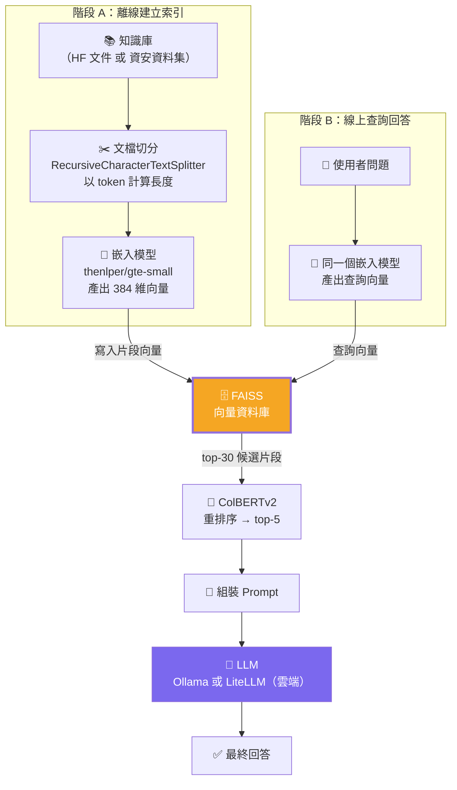
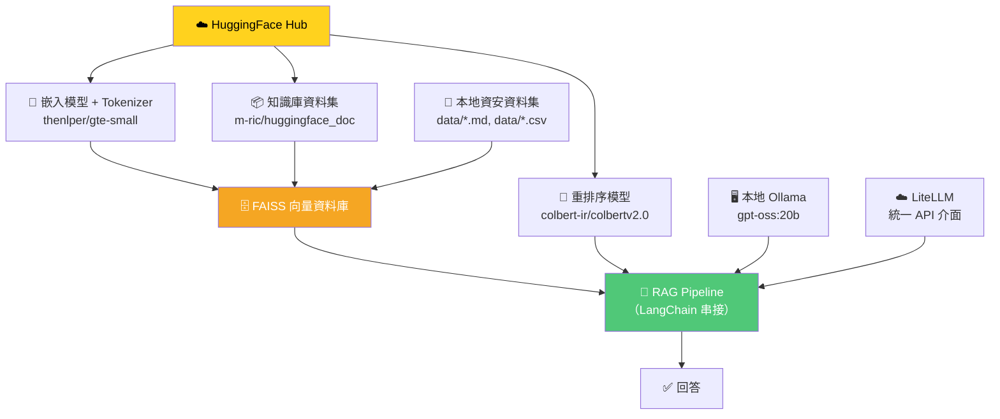
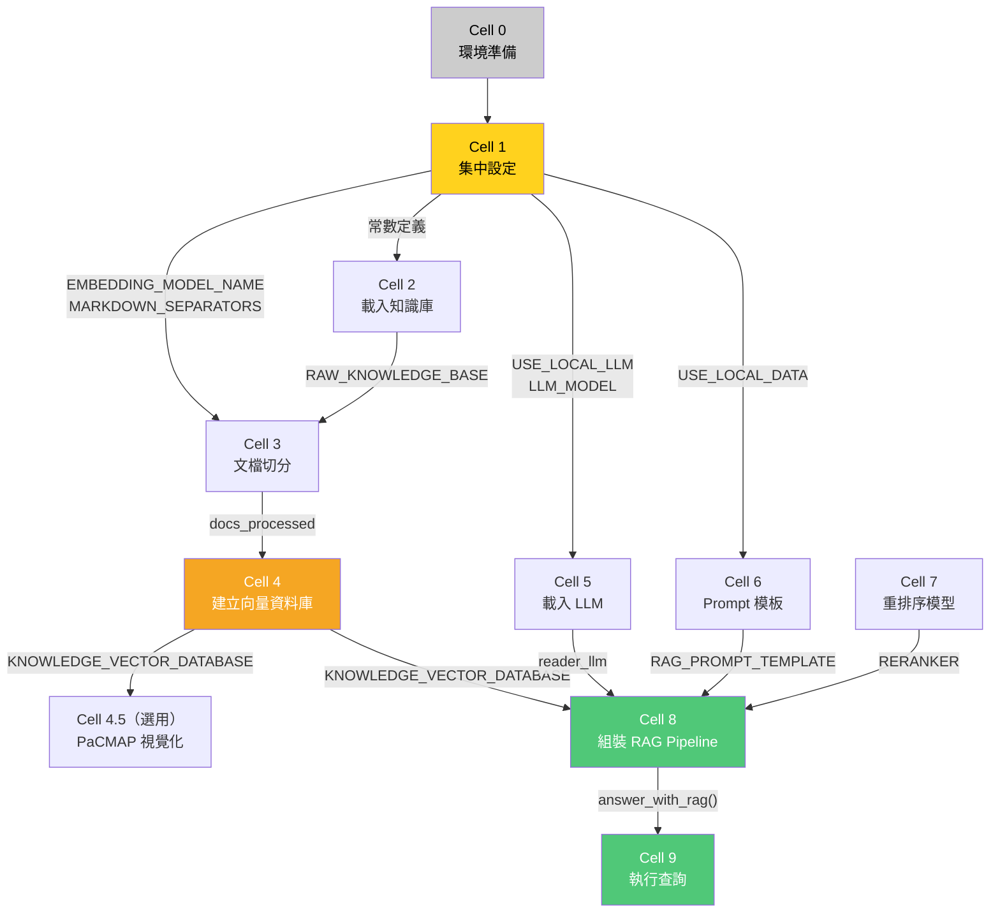
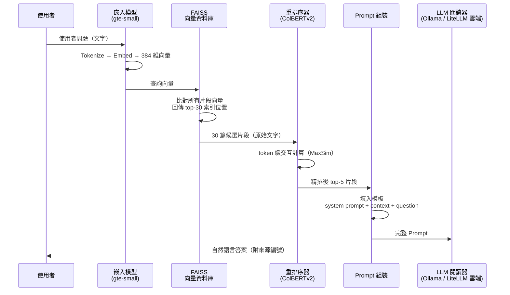

# Advanced RAG 系統 — 軟體設計文件（SDD）

---

## 一、文件資訊

| 項目 | 內容 |
|---|---|
| **文件名稱** | Advanced RAG 系統軟體設計文件（Software Design Document） |
| **版本** | v1.0 |
| **作者** | Joseph |
| **日期** | 2026-04-05 |
| **課程** | NTHU 114 學年第 2 學期 — LLM Security System |
| **對應作業** | Week 6 — TASK 2（Exceeding）：RAG 流程程式實作 |
| **實作格式** | Jupyter Notebook（`.ipynb`） |
| **理論參考** | [Advanced RAG Summary](./Advanced_RAG_Summary.md) / [HuggingFace Cookbook 原文](https://huggingface.co/learn/cookbook/zh-CN/advanced_rag) |

---

## 二、專案概述

### 2.1 目的

依據 HuggingFace Advanced RAG Cookbook，使用 **LangChain + FAISS + HuggingFace** 實作一套完整的 Advanced RAG 系統，涵蓋以下核心環節：

1. **資料讀取與切片** — 載入知識庫並以 token 為單位切分
2. **向量化** — 透過嵌入模型將文字轉為高維向量
3. **檢索** — 在 FAISS 向量資料庫中進行相似性搜索
4. **重排序** — 使用 ColBERTv2 對候選片段精排
5. **生成** — LLM 閱讀上下文並產生自然語言答案

### 2.2 範圍

本專案提供**兩組知識庫**與**兩種 LLM 模式**的切換能力：

| 維度 | 選項 A（原文範例） | 選項 B（資安應用） |
|---|---|---|
| **知識庫** | `m-ric/huggingface_doc`（HF 官方文件） | `data/` 目錄下的資安資料集（Prompt Injection + Phishing） |
| **LLM** | 本地 Ollama（gpt-oss:20b） | 雲端 API via LiteLLM（Gemini / Claude / OpenAI 等） |

### 2.3 對應作業要求

> TASK 2：延續 Task 1 主題，寫程式實作 RAG 的運作流程，並了解底層邏輯跟步驟（包含資料讀取與切片、向量化、檢索、生成...）

---

## 三、系統架構

### 3.1 整體架構：兩階段設計



### 3.2 組件依賴關係



### 3.3 確認框架

| 層級 | 選用技術 | 角色 |
|---|---|---|
| **RAG 框架** | LangChain | 串接所有組件的流水線框架 |
| **向量資料庫** | FAISS（IndexFlatIP） | 儲存與搜索片段向量 |
| **模型來源** | HuggingFace Hub | 提供嵌入模型、LLM、重排序模型、資料集 |
| **LLM 統一介面** | LiteLLM | 統一呼叫本地 Ollama 與雲端 API（Gemini / Claude / OpenAI 等） |

---

## 四、技術選型

### 4.1 Python 套件清單

| 套件 | 用途 | 安裝指令 |
|---|---|---|
| `torch` | PyTorch 深度學習框架 | `pip install torch` |
| `transformers` | HuggingFace 模型載入與推理 | `pip install transformers` |
| `accelerate` | 模型載入加速（嵌入模型用） | `pip install accelerate` |
| `ollama`（系統服務） | 本地 LLM 推理引擎 | 需預先安裝 Ollama 並執行 `ollama pull gpt-oss:20b` |
| `langchain` | RAG 流水線框架 | `pip install langchain` |
| `langchain-community` | LangChain 社群整合（FAISS、HF Embeddings） | `pip install langchain-community` |
| `sentence-transformers` | 句子嵌入模型封裝 | `pip install sentence-transformers` |
| `faiss-gpu` / `faiss-cpu` | 向量相似性搜索引擎 | `pip install faiss-gpu` 或 `faiss-cpu` |
| `datasets` | HuggingFace 資料集載入 | `pip install datasets` |
| `ragatouille` | ColBERTv2 重排序封裝 | `pip install ragatouille` |
| `litellm` | 統一雲端 LLM API 介面 | `pip install litellm` |
| `pacmap` | 嵌入視覺化降維 | `pip install pacmap` |
| `plotly` | 互動式圖表 | `pip install plotly` |
| `pandas` | 資料處理（載入 CSV） | `pip install pandas` |

### 4.2 核心模型組件

本系統使用的模型來自**兩個來源**：HuggingFace Hub 與本地 Ollama。

| # | 組件 | 來源 | 識別碼 | 用途 | 落在哪個階段 |
|---|---|---|---|---|---|
| 1 | 知識庫資料集 | HuggingFace Hub | `m-ric/huggingface_doc` | RAG 的外部知識來源 | 階段 A |
| 2 | 嵌入模型 + Tokenizer | HuggingFace Hub | `thenlper/gte-small` | 文字 → 384 維向量；切分時計算 token 數 | 階段 A + B |
| 3 | LLM 閱讀器 | **本地 Ollama** | `gpt-oss:20b` | 閱讀上下文並生成答案（透過 LiteLLM 呼叫） | 階段 B |
| 4 | 重排序模型 | HuggingFace Hub | `colbert-ir/colbertv2.0` | 對候選片段做 token 級精排 | 階段 B |

### 4.3 非 HuggingFace 工具

| 工具 | 來源 | 角色 |
|---|---|---|
| **FAISS** | Meta AI Research | 向量搜索引擎 |
| **LangChain** | LangChain Inc. | RAG 流水線框架 |
| **Ollama** | Ollama Inc. | 本地 LLM 推理引擎（封裝 Tokenizer + 模型推理） |
| **RAGatouille** | Benjamin Clavié | ColBERTv2 易用封裝 |
| **LiteLLM** | BerriAI | 統一 LLM 呼叫介面（同時支援本地 Ollama 與雲端 API） |
| **PaCMAP** | 學術研究 | 嵌入視覺化降維 |

---

## 五、資料設計

### 5.1 知識庫 A：HuggingFace 官方文件（原文範例）

| 項目 | 說明 |
|---|---|
| **來源** | `datasets.load_dataset("m-ric/huggingface_doc", split="train")` |
| **內容** | HuggingFace 官方文件的純文字集合 |
| **每筆欄位** | `text`（文件內容）、`source`（來源 URL） |
| **用途** | 先用此資料集跑通完整 RAG 流程 |

### 5.2 知識庫 B：資安資料集（延續 Task 1）

| 檔案 | 格式 | 筆數 | 內容 |
|---|---|---|---|
| `data/knowledge_base.md` | Markdown | 30 筆（15 攻擊 + 15 正常） | Prompt Injection 攻擊知識庫，含 8 種攻擊類型 |
| `data/phishing_knowledge_base.md` | Markdown | 多筆 | 釣魚郵件分析知識庫 |
| `data/prompt_injection_dataset.csv` | CSV | 30 筆 | 結構化 Prompt Injection 資料（含 label、attack_type、severity 等） |
| `data/phishing_email_dataset.csv` | CSV | 15 筆 | 結構化釣魚郵件資料（含 sender、subject、body、label 等） |

**資安知識庫的載入策略**（完整實作見 Cell 2）：

| 資料類型 | 載入方式 | 轉換邏輯 |
|---|---|---|
| **Markdown 檔案** | 整份讀入，作為一篇 `LangchainDocument` | 後續由 Cell 3 的切分器按 Markdown 標題邊界自動切分 |
| **PI CSV** | 逐筆讀取，每筆拼接 `id`、`attack_type`、`severity`、`text`、`system_prompt`、`label` | 每筆成為一篇獨立的 `LangchainDocument` |
| **Phishing CSV** | 逐筆讀取，每筆拼接 `email_id`、`sender`、`subject`、`body`、`urls`、`label`、`indicators` | 每筆成為一篇獨立的 `LangchainDocument` |

### 5.3 LangchainDocument 結構

所有知識庫資料統一轉換為 LangChain 的 `Document` 物件：

| 欄位 | 型態 | 用途 |
|---|---|---|
| `page_content` | `str` | 文件文字內容 → 被切分、嵌入、搜索、塞入 Prompt |
| `metadata` | `dict` | 附加資訊（來源等）→ 不參與嵌入，保留供引用來源 |

### 5.4 切分策略

| 參數 | 值 | 說明 |
|---|---|---|
| **切分器** | `RecursiveCharacterTextSplitter.from_huggingface_tokenizer()` | 以 token 數計算長度 |
| **Tokenizer** | `thenlper/gte-small` 的 Tokenizer | 必須與嵌入模型配套 |
| **chunk_size** | `512` | 嵌入模型 `max_seq_length` 上限 |
| **chunk_overlap** | `51`（≈ chunk_size / 10） | 減少語義在邊界被切斷 |
| **separators** | Markdown 專用分隔符清單 | 按語義邊界重要性由高到低嘗試 |
| **去重** | 比對 `page_content` 去除重複片段 | 避免相同內容重複索引 |

分隔符優先順序：

```
Markdown 標題 → 程式碼區塊 → 水平線 → 段落 → 換行 → 空格 → 逐字元
```

---

## 六、模組設計（對應 Notebook Cell）

### 6.0 Cell 執行順序與資料流

以下圖表顯示各 Cell 之間的依賴關係與資料流向。箭頭上標註的是傳遞的變數名稱。



> **執行順序**：Cell 0 → 1 → 2 → 3 → 4 → (4.5) → 5 / 6 / 7（可平行）→ 8 → 9。Cell 5、6、7 之間沒有依賴關係，可以任意順序執行。

---

### Cell 0：環境準備

| 項目 | 說明 |
|---|---|
| **功能** | 安裝所有相依套件 |
| **輸入** | 無 |
| **輸出** | 套件安裝完成 |
| **關鍵指令** | `pip install torch transformers accelerate langchain langchain-community sentence-transformers faiss-gpu datasets ragatouille litellm pacmap plotly pandas` |

```python
# Cell 0：安裝相依套件
!pip install torch transformers accelerate \
    langchain langchain-community \
    sentence-transformers faiss-gpu \
    datasets ragatouille \
    litellm \
    pacmap plotly pandas

# 另外需要安裝 Ollama（本地 LLM 推理引擎）：
# 1. 安裝 Ollama：https://ollama.com/download
# 2. 拉取模型：ollama pull gpt-oss:20b
# 3. 確認 Ollama 服務已啟動（預設 http://localhost:11434）
```

---

### Cell 1：集中設定（Constants & Config）

| 項目 | 說明 |
|---|---|
| **功能** | 統一定義所有常數與切換旗標，避免散落各 Cell |
| **輸入** | 無 |
| **輸出** | 全域常數與旗標 |

```python
# Cell 1：集中設定

# ===== 切換旗標 =====
USE_LOCAL_DATA = False   # True = 資安資料集 / False = HF 官方文件
USE_LOCAL_LLM  = True    # True = 本地 Ollama / False = 雲端 LiteLLM

# ===== 嵌入模型設定 =====
EMBEDDING_MODEL_NAME = "thenlper/gte-small"   # 384 維，max_seq_length=512

# ===== LLM 設定 =====
if USE_LOCAL_LLM:
    LLM_MODEL    = "ollama/gpt-oss:20b"
    LLM_API_BASE = "http://localhost:11434"
else:
    LLM_MODEL    = "gemini/gemini-2.5-flash"  # 或其他 LiteLLM 支援的模型
    LLM_API_BASE = None

LLM_TEMPERATURE = 0.2
LLM_MAX_TOKENS  = 500

# ===== 切分設定 =====
CHUNK_SIZE    = 512     # 每個片段最大 token 數（≤ 嵌入模型 max_seq_length）
CHUNK_OVERLAP = 51      # 相鄰片段重疊 token 數（≈ chunk_size / 10）

# 針對 Markdown 文件的分隔符清單（按語義重要性由高到低）
MARKDOWN_SEPARATORS = [
    "\n#{1,6} ",       # Markdown 標題（最重要的語義邊界）
    "```\n",           # 程式碼區塊邊界
    "\n\\*\\*\\*+\n",  # 水平線 ***
    "\n---+\n",        # 水平線 ---
    "\n___+\n",        # 水平線 ___
    "\n\n",            # 段落分隔
    "\n",              # 換行
    " ",               # 空格
    "",                # 逐字元拆分（最後手段）
]

# ===== 檢索設定 =====
NUM_RETRIEVED_DOCS = 30  # FAISS 粗檢索取回數量
NUM_DOCS_FINAL     = 5   # 精排後保留數量
```

---

### Cell 2：載入知識庫

| 項目 | 說明 |
|---|---|
| **功能** | 載入知識庫原始資料，轉成 `LangchainDocument` 清單 |
| **輸入** | Cell 1 的 `USE_LOCAL_DATA` 旗標 |
| **輸出** | `RAW_KNOWLEDGE_BASE: List[LangchainDocument]` |
| **關鍵參數** | `USE_LOCAL_DATA: bool`（來自 Cell 1） |

```python
# Cell 2：載入知識庫
import datasets
import pandas as pd
from langchain.docstore.document import Document as LangchainDocument

if not USE_LOCAL_DATA:
    # ===== 方式 A：從 HuggingFace Hub 載入 =====
    ds = datasets.load_dataset("m-ric/huggingface_doc", split="train")
    RAW_KNOWLEDGE_BASE = [
        LangchainDocument(page_content=doc["text"], metadata={"source": doc["source"]})
        for doc in ds
    ]
else:
    # ===== 方式 B：從本地資安資料集載入 =====
    RAW_KNOWLEDGE_BASE = []

    # (1) Markdown 知識庫：整份檔案作為一篇文件
    for md_file in ["data/knowledge_base.md", "data/phishing_knowledge_base.md"]:
        with open(md_file, "r", encoding="utf-8") as f:
            text = f.read()
        RAW_KNOWLEDGE_BASE.append(
            LangchainDocument(page_content=text, metadata={"source": md_file})
        )

    # (2) Prompt Injection CSV：每筆拼接關鍵欄位成一段文字
    df_pi = pd.read_csv("data/prompt_injection_dataset.csv")
    for _, row in df_pi.iterrows():
        content = (
            f"[{row['id']}] 攻擊類型: {row['attack_type']}\n"
            f"嚴重程度: {row['severity']}/5\n"
            f"語言: {row['language']}\n"
            f"輸入文字: {row['text']}\n"
            f"對應系統指令: {row['system_prompt']}\n"
            f"標籤: {'攻擊' if row['label'] == 1 else '正常'}"
        )
        RAW_KNOWLEDGE_BASE.append(
            LangchainDocument(page_content=content, metadata={"source": row["id"]})
        )

    # (3) Phishing Email CSV：每筆拼接關鍵欄位成一段文字
    df_ph = pd.read_csv("data/phishing_email_dataset.csv")
    for _, row in df_ph.iterrows():
        content = (
            f"[{row['email_id']}] 寄件者: {row['sender']}\n"
            f"主旨: {row['subject']}\n"
            f"內容: {row['body']}\n"
            f"URL: {row.get('urls', 'N/A')}\n"
            f"緊急程度: {row['urgency_level']}\n"
            f"攻擊類型: {row.get('attack_type', 'N/A')}\n"
            f"標籤: {row['label']}\n"
            f"關鍵指標: {row.get('indicators', 'N/A')}"
        )
        RAW_KNOWLEDGE_BASE.append(
            LangchainDocument(page_content=content, metadata={"source": row["email_id"]})
        )

print(f"共載入 {len(RAW_KNOWLEDGE_BASE)} 篇文檔")
# 抽樣檢查
for doc in RAW_KNOWLEDGE_BASE[:2]:
    print(f"  來源: {doc.metadata['source']}")
    print(f"  內容預覽: {doc.page_content[:200]}...\n")
```

**驗證**：印出文檔數量（HF 文件：數百篇；資安資料集：~47 篇）、前 2 筆的 `metadata` 與 `page_content` 預覽。

---

### Cell 3：文檔切分

| 項目 | 說明 |
|---|---|
| **功能** | 將長文件切成 ≤ `CHUNK_SIZE` token 的小片段，並去除重複 |
| **輸入** | `RAW_KNOWLEDGE_BASE: List[LangchainDocument]`（來自 Cell 2） |
| **輸出** | `docs_processed: List[LangchainDocument]`（去重後） |
| **關鍵參數** | 來自 Cell 1：`CHUNK_SIZE`, `CHUNK_OVERLAP`, `MARKDOWN_SEPARATORS`, `EMBEDDING_MODEL_NAME` |
| **HF 組件** | `thenlper/gte-small` 的 Tokenizer（計算 token 數） |

```python
# Cell 3：文檔切分
from langchain.text_splitter import RecursiveCharacterTextSplitter
from transformers import AutoTokenizer

# 建立切分器：使用嵌入模型的 Tokenizer 以 token 數計算片段長度
text_splitter = RecursiveCharacterTextSplitter.from_huggingface_tokenizer(
    AutoTokenizer.from_pretrained(EMBEDDING_MODEL_NAME),  # Cell 1 定義的常數
    chunk_size=CHUNK_SIZE,          # Cell 1 定義：512
    chunk_overlap=CHUNK_OVERLAP,    # Cell 1 定義：51
    add_start_index=True,           # 在 metadata 記錄片段在原文的起始位置
    strip_whitespace=True,
    separators=MARKDOWN_SEPARATORS, # Cell 1 定義的 Markdown 分隔符
)

# 對所有文件執行切分
docs_processed = []
for doc in RAW_KNOWLEDGE_BASE:
    docs_processed += text_splitter.split_documents([doc])

# 去除重複片段
seen = set()
docs_unique = []
for doc in docs_processed:
    if doc.page_content not in seen:
        seen.add(doc.page_content)
        docs_unique.append(doc)
docs_processed = docs_unique

print(f"切分後共 {len(docs_processed)} 個片段（去重前：{len(docs_processed) + len(seen) - len(docs_unique)}）")
```

**驗證**：印出片段數量、隨機抽 3 個片段檢查長度是否 ≤ 512 tokens。

---

### Cell 4：建立向量資料庫

| 項目 | 說明 |
|---|---|
| **功能** | 將所有片段嵌入為向量，存入 FAISS 索引 |
| **輸入** | `docs_processed: List[LangchainDocument]` |
| **輸出** | `KNOWLEDGE_VECTOR_DATABASE: FAISS` |
| **關鍵參數** | `normalize_embeddings=True`, `distance_strategy=COSINE` |
| **HF 組件** | `thenlper/gte-small` 嵌入模型 |

```python
# Cell 4：建立向量資料庫
embedding_model = HuggingFaceEmbeddings(
    model_name=EMBEDDING_MODEL_NAME,
    model_kwargs={"device": "cuda"},         # 或 "cpu"
    encode_kwargs={"normalize_embeddings": True},
)

KNOWLEDGE_VECTOR_DATABASE = FAISS.from_documents(
    docs_processed, embedding_model, distance_strategy=DistanceStrategy.COSINE
)
print(f"向量資料庫建立完成，共 {KNOWLEDGE_VECTOR_DATABASE.index.ntotal} 筆向量")
```

**驗證**：確認 `index.ntotal` 等於 `len(docs_processed)`，並執行一次測試搜索。

---

### Cell 4.5：（選用）PaCMAP 嵌入視覺化

| 項目 | 說明 |
|---|---|
| **功能** | 將 384 維向量降至 2 維，用散點圖觀察分布 |
| **輸入** | `KNOWLEDGE_VECTOR_DATABASE`, 查詢字串 |
| **輸出** | 互動式 Plotly 散點圖 |
| **關鍵參數** | `n_components=2`, `init="pca"` |

```python
# Cell 4.5：PaCMAP 視覺化
# 從 FAISS 取出所有向量 → PaCMAP 降到 2 維 → Plotly 散點圖
# 把使用者查詢也嵌入並畫上去，觀察它與哪些片段最接近
```

**驗證**：觀察同來源的片段是否聚成一簇；查詢點是否落在相關片段附近。

---

### Cell 5：載入 LLM 閱讀器

| 項目 | 說明 |
|---|---|
| **功能** | 載入 LLM，支援本地 Ollama 或雲端 API 兩種模式 |
| **輸入** | Cell 1 的 `USE_LOCAL_LLM`, `LLM_MODEL`, `LLM_API_BASE`, `LLM_TEMPERATURE`, `LLM_MAX_TOKENS` |
| **輸出** | `reader_llm` — 可呼叫的 LLM 函式（統一介面） |
| **關鍵參數** | 見下方模式對照表 |

> **設計簡化**：本地和雲端都透過 **LiteLLM** 統一呼叫，差別只在 `model` 參數不同。Ollama 封裝了 Tokenizer + 模型推理，不需要手動載入模型或處理量化。

#### 模式 A：本地 Ollama（gpt-oss:20b）

| 參數 | 值 | 說明 |
|---|---|---|
| `model` | `"ollama/gpt-oss:20b"` | LiteLLM 的 Ollama 模型識別碼 |
| `api_base` | `"http://localhost:11434"` | Ollama 服務位址 |
| `temperature` | `0.2` | 低溫度 = 回答更確定 |
| `max_tokens` | `500` | 最多生成 500 tokens |

**前置條件**：確認 Ollama 服務已啟動且模型已下載。

```bash
# 確認 Ollama 服務狀態
ollama list          # 應能看到 gpt-oss:20b
curl http://localhost:11434/api/tags  # 測試 API 是否回應
```

```python
# 模式 A：本地 Ollama（透過 LiteLLM 呼叫）
import litellm

def reader_llm(prompt: str) -> str:
    response = litellm.completion(
        model="ollama/gpt-oss:20b",
        messages=[{"role": "user", "content": prompt}],
        api_base="http://localhost:11434",
        temperature=0.2,
        max_tokens=500,
    )
    return response.choices[0].message.content
```

#### 模式 B：雲端 API via LiteLLM

| 參數 | 值 | 說明 |
|---|---|---|
| `model` | `"gemini/gemini-2.5-flash"` 等 | LiteLLM 支援的模型識別碼 |
| `temperature` | `0.2` | 與本地模式一致 |
| `max_tokens` | `500` | 最多生成 500 tokens |

```python
# 模式 B：雲端 LiteLLM
import litellm

def reader_llm(prompt: str) -> str:
    response = litellm.completion(
        model="gemini/gemini-2.5-flash",  # 可替換為其他模型
        messages=[{"role": "user", "content": prompt}],
        temperature=0.2,
        max_tokens=500,
    )
    return response.choices[0].message.content
```

#### 模式切換設計

```python
# Cell 5：載入 LLM 閱讀器（本地與雲端都透過 LiteLLM 統一呼叫）
# LLM_MODEL, LLM_API_BASE, LLM_TEMPERATURE, LLM_MAX_TOKENS 皆來自 Cell 1
import litellm

def reader_llm(prompt: str) -> str:
    """統一的 LLM 呼叫介面，根據 Cell 1 設定自動選擇本地 Ollama 或雲端 API。"""
    response = litellm.completion(
        model=LLM_MODEL,
        messages=[{"role": "user", "content": prompt}],
        temperature=LLM_TEMPERATURE,
        max_tokens=LLM_MAX_TOKENS,
        **({"api_base": LLM_API_BASE} if LLM_API_BASE else {}),
    )
    return response.choices[0].message.content

# 測試 LLM 是否正常
print(f"LLM 模式：{'本地 Ollama' if USE_LOCAL_LLM else '雲端 API'}（{LLM_MODEL}）")
print(reader_llm("Hello, please respond with one sentence to confirm you are working."))
```

**驗證**：用簡單 prompt（如 "What is RAG?"）測試 LLM 是否正常回應。

---

### Cell 6：定義 Prompt 模板

| 項目 | 說明 |
|---|---|
| **功能** | 定義 RAG 的 prompt 格式（system + user） |
| **輸入** | 無（純模板定義） |
| **輸出** | `RAG_PROMPT_TEMPLATE: str` |
| **設計原則** | 限定範圍、要求簡潔、引用來源、允許拒答 |

由於本地（Ollama）和雲端都透過 **LiteLLM** 統一呼叫，Prompt 格式**不需要根據 LLM 模式調整**。LiteLLM 和 Ollama 會自動處理聊天格式轉換，你只需提供純文字 prompt。

提供兩個語言版本的模板，根據知識庫語言選用：

```python
# Cell 6：Prompt 模板（根據知識庫語言選用）

# 英文版（適用 HF 官方文件知識庫）
RAG_PROMPT_TEMPLATE_EN = """Based on the following context, answer the question.
Only use the provided context. If the answer cannot be found, say so.
Provide source document numbers when relevant.

Context:
{context}

Question: {question}

Answer:"""

# 中文版（適用資安知識庫）
RAG_PROMPT_TEMPLATE_ZH = """請根據以下提供的上下文資料回答問題。
只能使用上下文中的資訊，如果無法從中得出答案，請直接說明「無法根據提供的資料回答」。
回答時請標註引用的來源文件編號。

上下文：
{context}

問題：{question}

回答："""

# 根據知識庫來源選擇模板
RAG_PROMPT_TEMPLATE = RAG_PROMPT_TEMPLATE_ZH if USE_LOCAL_DATA else RAG_PROMPT_TEMPLATE_EN
```

---

### Cell 7：載入重排序模型

| 項目 | 說明 |
|---|---|
| **功能** | 載入 ColBERTv2 延遲交互模型 |
| **輸入** | 無 |
| **輸出** | `RERANKER: RAGPretrainedModel` |
| **HF 組件** | `colbert-ir/colbertv2.0` |

```python
# Cell 7：載入重排序模型
from ragatouille import RAGPretrainedModel
RERANKER = RAGPretrainedModel.from_pretrained("colbert-ir/colbertv2.0")
```

**驗證**：用一個簡單查詢和 5 個文字片段測試 `RERANKER.rerank()` 是否正常回傳排序結果。

---

### Cell 8：組裝完整 RAG 流水線

| 項目 | 說明 |
|---|---|
| **功能** | 串接所有組件：檢索 → 重排序 → 組裝 Prompt → 生成 |
| **輸入** | `question: str` |
| **輸出** | `(answer: str, relevant_docs: List[str])` |
| **關鍵參數** | `num_retrieved_docs=30`, `num_docs_final=5` |

```python
# Cell 8：完整 RAG Pipeline
def answer_with_rag(
    question: str,
    llm,                          # LLM 函式（reader_llm，本地與雲端共用同一介面）
    knowledge_index: FAISS,
    reranker=None,
    num_retrieved_docs: int = 30,
    num_docs_final: int = 5,
) -> Tuple[str, List[str]]:
    # 1. FAISS 粗檢索 top-30
    relevant_docs = knowledge_index.similarity_search(query=question, k=num_retrieved_docs)
    relevant_texts = [doc.page_content for doc in relevant_docs]

    # 2. ColBERTv2 精排序 → top-5
    if reranker:
        reranked = reranker.rerank(question, relevant_texts, k=num_docs_final)
        relevant_texts = [doc["content"] for doc in reranked]
    else:
        relevant_texts = relevant_texts[:num_docs_final]

    # 3. 組裝 context（將片段編號後拼接）
    context = "\n".join([f"Document {i}:::\n{text}" for i, text in enumerate(relevant_texts)])

    # 4. 填入 Prompt 模板
    final_prompt = RAG_PROMPT_TEMPLATE.format(question=question, context=context)

    # 5. LLM 生成答案（透過 LiteLLM 統一呼叫，本地/雲端共用）
    answer = llm(final_prompt)

    return answer, relevant_texts
```

---

### Cell 9：執行查詢與結果展示

| 項目 | 說明 |
|---|---|
| **功能** | 執行查詢並展示答案與來源 |
| **輸入** | 使用者問題字串 |
| **輸出** | 印出答案、來源片段 |

```python
# Cell 9：執行查詢

# 範例問題（根據知識庫選擇）
# HF 文件知識庫：
question = "How to create a pipeline object?"

# 資安知識庫：
# question = "什麼是 Prompt Injection 的角色扮演型攻擊？"

answer, docs = answer_with_rag(question, reader_llm, KNOWLEDGE_VECTOR_DATABASE, reranker=RERANKER)
print("Answer:", answer)
for i, doc in enumerate(docs):
    print(f"\n--- Source {i} ---\n{doc[:200]}...")
```

---

## 七、流程設計

### 7.1 端到端 Sequence Diagram



### 7.2 資料變換流程

```
原始文字 ──[Tokenizer A]──→ Token IDs ──[Embedding Model]──→ 384 維向量 ──[FAISS]──→ 索引位置
                                                                                        │
                                                                              直接查表取回原始文字
                                                                                        │
                                                                                        ▼
                                                            組裝 Prompt ← 原始文字片段 + 使用者問題
                                                                │
                                                    ┌───────────┴───────────┐
                                                    │ 本地模式                │ 雲端模式
                                                    │ Ollama (gpt-oss:20b)   │ LiteLLM 雲端 API
                                                    │ via LiteLLM            │ （Gemini 等）
                                                    │ （內部自動處理）         │ （內部自動處理）
                                                    └───────────┬───────────┘
                                                                │
                                                                ▼
                                                          最終回答（文字）
```

---

## 八、參數配置表

| 模組 | 參數 | 預設值 | 說明 |
|---|---|---|---|
| **切分** | `chunk_size` | `512` | 每個片段最大 token 數（≤ 嵌入模型 max_seq_length） |
| **切分** | `chunk_overlap` | `51` | 相鄰片段重疊 token 數（≈ chunk_size / 10） |
| **嵌入** | `model_name` | `"thenlper/gte-small"` | 嵌入模型名稱（384 維） |
| **嵌入** | `normalize_embeddings` | `True` | 歸一化，使點積 = 餘弦相似度 |
| **嵌入** | `device` | `"cuda"` | 計算裝置（`"cuda"` 或 `"cpu"`） |
| **FAISS** | `distance_strategy` | `COSINE` | 距離度量方式 |
| **檢索** | `num_retrieved_docs` | `30` | FAISS 粗檢索取回數量 |
| **重排序** | `num_docs_final` | `5` | 精排後保留數量 |
| **本地 LLM** | `model` | `"ollama/gpt-oss:20b"` | LiteLLM 的 Ollama 模型識別碼 |
| **本地 LLM** | `api_base` | `"http://localhost:11434"` | Ollama 服務位址 |
| **本地 LLM** | `temperature` | `0.2` | 生成溫度（越低越確定） |
| **本地 LLM** | `max_tokens` | `500` | 最大生成長度 |
| **雲端 LLM** | `model` | `"gemini/gemini-2.5-flash"` | LiteLLM 模型識別碼 |
| **雲端 LLM** | `temperature` | `0.2` | 生成溫度 |
| **雲端 LLM** | `max_tokens` | `500` | 最大生成長度 |
| **切換** | `USE_LOCAL_DATA` | `False` | `True` = 資安資料集 / `False` = HF 文件 |
| **切換** | `USE_LOCAL_LLM` | `True` | `True` = 本地 Ollama / `False` = 雲端 LiteLLM |

---

## 九、驗證計畫

### 9.1 逐步驗證

| Cell | 驗證方式 | 預期結果 |
|---|---|---|
| **Cell 1** | 印出所有常數確認值正確 | 旗標、模型名稱、切分參數皆正確 |
| **Cell 2** | `print(len(RAW_KNOWLEDGE_BASE))` + 抽樣檢查 | HF 文件：數百篇；資安資料集：~47 篇 |
| **Cell 3** | `print(len(docs_processed))` + 抽樣檢查片段長度 | 所有片段 ≤ 512 tokens，無重複 |
| **Cell 4** | `index.ntotal == len(docs_processed)` + 測試搜索 | 向量數量正確，搜索回傳相關結果 |
| **Cell 4.5** | 觀察散點圖 | 同來源片段聚簇，查詢落在相關片段附近 |
| **Cell 5** | 簡單 prompt 測試 | LLM 回傳合理文字（確認 Ollama / 雲端連線正常） |
| **Cell 7** | 測試 `reranker.rerank()` | 回傳排序結果，最相關的排在前面 |
| **Cell 8+9** | 完整 RAG 查詢 | 答案引用正確的來源片段，內容相關且準確 |

### 9.2 端到端驗證問題

| 知識庫 | 測試問題 | 預期答案方向 |
|---|---|---|
| HF 文件 | "How to create a pipeline object?" | 說明 `pipeline()` 的使用方法 |
| HF 文件 | "What is a tokenizer?" | 說明 Tokenizer 的功能 |
| 資安 - PI | "什麼是 Prompt Injection 的角色扮演型攻擊？" | 回傳 role-play 類型的說明和範例（PI-0003, PI-0010） |
| 資安 - PI | "如何辨識忽略指令型攻擊？" | 回傳 ignore-previous-instructions 的特徵和關鍵詞 |
| 資安 - Phishing | "PayPal 釣魚郵件有什麼特徵？" | 回傳 PHISH-001 的 indicators |

### 9.3 常見錯誤與除錯

| 錯誤 | 可能原因 | 解法 |
|---|---|---|
| CUDA out of memory | 嵌入模型 GPU 記憶體不足 | 嵌入模型改用 `"cpu"`（LLM 走 Ollama 不受影響） |
| 搜索結果不相關 | 知識庫太小或切分不當 | 檢查片段內容，調整 chunk_size |
| LLM 不遵守指令 | Prompt 格式或模型能力問題 | 調整 Prompt 模板或嘗試更強的模型 |
| Reranker 報錯 | RAGatouille 版本不相容 | 檢查版本，嘗試 `pip install --upgrade ragatouille` |
| LiteLLM API 錯誤（雲端） | API Key 未設定 | 設定環境變數 `GEMINI_API_KEY` 等 |
| Ollama 連線失敗 | Ollama 服務未啟動 | 執行 `ollama serve` 或確認 `http://localhost:11434` 可連線 |
| Ollama 模型未找到 | 模型未下載 | 執行 `ollama pull gpt-oss:20b` |

---

## 十、附錄

### 10.1 參考資料

| 資源 | 連結 |
|---|---|
| HuggingFace Advanced RAG Cookbook（原文） | https://huggingface.co/learn/cookbook/zh-CN/advanced_rag |
| Advanced RAG Summary（本專案理論文件） | `docs/Advanced_RAG_Summary.md` |
| LangChain 官方文件 | https://python.langchain.com/docs/ |
| FAISS 官方文件 | https://faiss.ai/ |
| LiteLLM 官方文件 | https://docs.litellm.ai/ |
| Sentence Transformers | https://www.sbert.net/ |
| MTEB Leaderboard（嵌入模型排行榜） | https://huggingface.co/spaces/mteb/leaderboard |
| ColBERTv2 論文 | https://arxiv.org/abs/2112.01488 |

### 10.2 名詞對照表

| 英文 | 繁體中文 | 說明 |
|---|---|---|
| RAG | 檢索增強生成 | Retrieval-Augmented Generation |
| Embedding | 嵌入 | 將文字轉成高維向量 |
| Tokenizer | 分詞器 | 將文字切成 token 並轉為數字 ID |
| Token | 詞元 / Token | 模型處理的最小文字單位 |
| Chunk | 片段 | 切分後的文件區塊 |
| Vector Database | 向量資料庫 | 儲存並搜索向量的資料庫 |
| Cosine Similarity | 餘弦相似度 | 兩向量夾角的 cos 值 |
| Normalization | 歸一化 | 將向量長度縮放到 1 |
| Reranking | 重排序 | 對檢索結果做精排 |
| Late Interaction | 延遲交互 | ColBERTv2 的架構類型 |
| Quantization | 量化 | 降低模型精度以節省記憶體 |
| Bi-encoder | 雙編碼器 | 對查詢和文檔分別編碼 |
| Cross-encoder | 交叉編碼器 | 對查詢和文檔聯合編碼 |
| Pipeline | 流水線 | 端到端的處理流程 |
| Context Window | 上下文窗口 | LLM 一次能處理的最大 token 數 |
| Prompt Template | 提示模板 | 填入上下文和問題的格式化模板 |
| LiteLLM | LiteLLM | 統一 LLM 呼叫介面（支援本地 Ollama + 雲端 API） |
